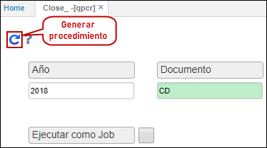

# QPCR - Cierres Presupuestales

La aplicación **QPCR** permite ejecutar el procedimiento que realizará el cierre de los documentos presupuestales seleccionados previamente en la aplicación [**QDCA - Presupuesto Documentos Cierre**](http://docs.oasiscom.com/Operacion/erp/presupuestoo/qproceso/qdca). (_Ver aplicación_)  

Ingresamos por el año al cual se va hacer el cierre y el documento.  

