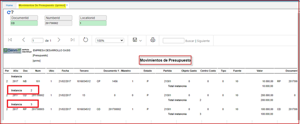

# Informe Mensual de Ejecución del Presupuesto de Gastos Detallado - Apropiación de la Vigencia - QRAM3R  

Reporte del módulo de presupuesto **QRAM3R**.  
Informe Mensual de Ejecución del Presupuesto de Gastos Detallado - Apropiación de la Vigencia.  
Parámetros de entrada:   
Periodo y año.   

 

