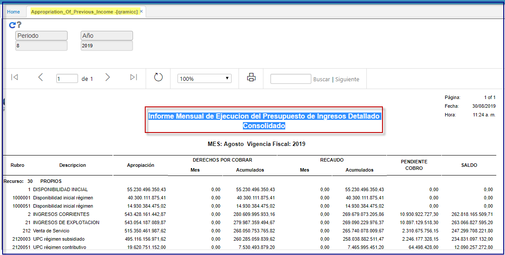

# QRAMI3 - Ejecución mensual presupuesto de Ingresos Detallado - Consolidado    

QRAMI3  
Informe Mensual de Ejecucion del Presupuesto de Ingresos Detallado  
Apropiación de la Vigencia.  
Este reporte es el generalizado y para efectos de impresion se divide en dos:  

QRAMI3A   
PARTE.1.  
Informe Mensual de Ejecucion del Presupuesto de Ingresos Detallado.  
Apropiación de la Vigencia.  

QRAMI3B  
PARTE.2.  
Informe Mensual de Ejecucion del Presupuesto de Ingresos Detallado  
Cuenta por Cobrar.  
Apropiación de la Vigencia  
Se realizan los filtros de periodo, año.  

	

