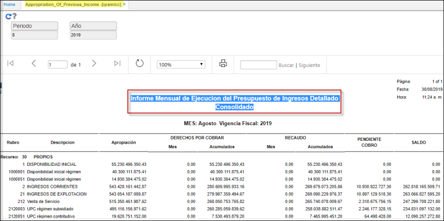

# QRAMICC - Ejecución mensual presupuesto de Ingresos Detallado - Consolidado    

Informe que extrae toda la informacion de la reserva presupuestal.  
Informe Mensual de Ejecucion del Presupuesto de Ingresos Detallado - Consolidado  
Agrupa cuentas por pagar mas la vigencia actual.  
Se realizan los filtros de periodo, año.  

	

QRAMICC

