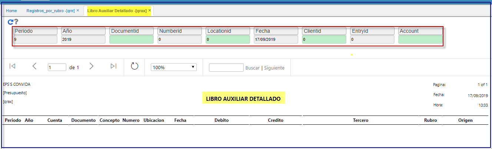

# QRAX -Libro Auxiliar Detallado de Presupuesto Oficial  

Informe que extrae toda la afectacion contable y si tiene Rubro asociado a la cuenta contable.  
Se denomina libro auxiliar detallado de Presupuesto Oficial.  

* Se realizan los filtros de:  

**Periodo:**  
**Año:**  
**Documento:**  
**Numero:**  
**Ubicacion:**  
**Fecha:**  
**Cliente:**  
**Entrada:**  
**Cuenta:**  

	 

**QRAX**  

