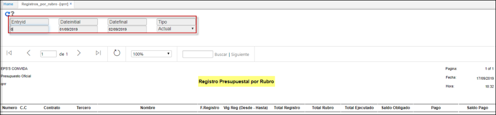

# QRRR - Registro Presupuestal por Rubro  

Informe que extrae toda la informacion de todos  Registros Presupuestales asociados a ese Rubro; presentando el tercero, las fechas de contrato, y los valores de las instancias de:  
* Comprometido.  
* Obligado.  
* Pago.  

Se realizan los filtros de:   
**EntryId:**  Rubro.  
**Fecha inicial:**  Data.  
**Fecha final:**  Data.  
**Tipo:**  Actual, Reserva, Cuenta por Pagar.  

	 

**QRRR**

