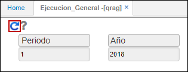
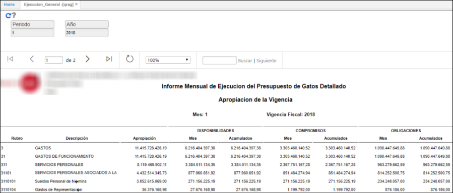

# Ejecución General - QRAG

Reporte que muestra la ejecución general del proceso Chip Presupuestal generado previamente en la aplicación [**KPGF - Genera Formatos**](http://docs.oasiscom.com/Operacion/erp/contabilidad/kproceso/kpgf#proceso-chip-presupuestal).  

Consultamos por periodo, año.  

Al generar el reporte se visualizará la información.  

