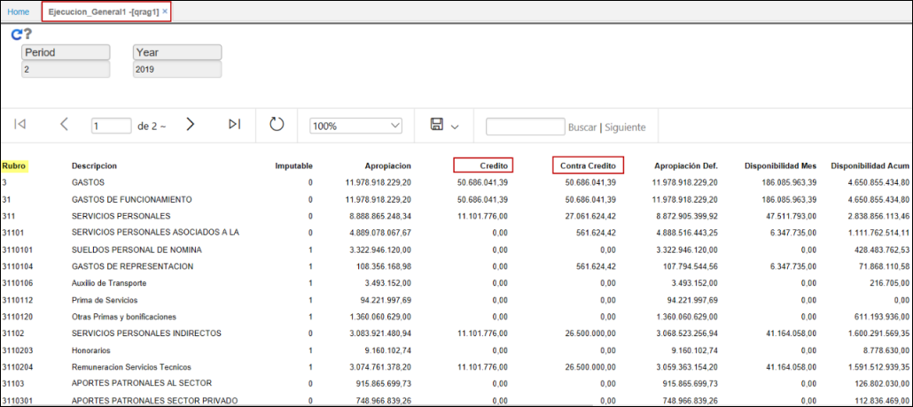
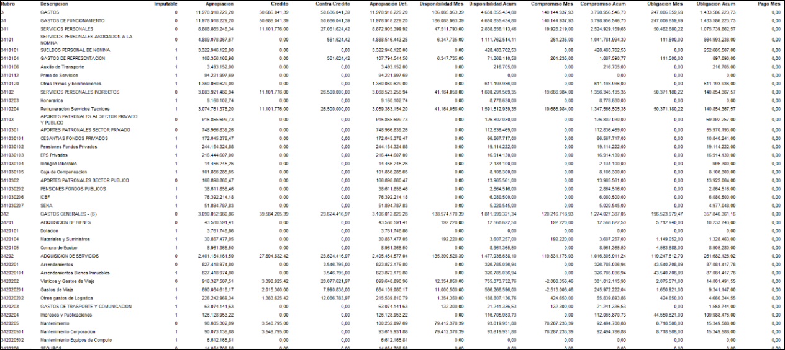

# QRAG1 - Ejecución General

Reporte **[QRAG1]** que reseña la ejecución mensual presentando los créditos y contra créditos presupuestal.  

Consultamos por periodo, año.  

* Al exporat a excel  el reporte visualizará la información asi:  

