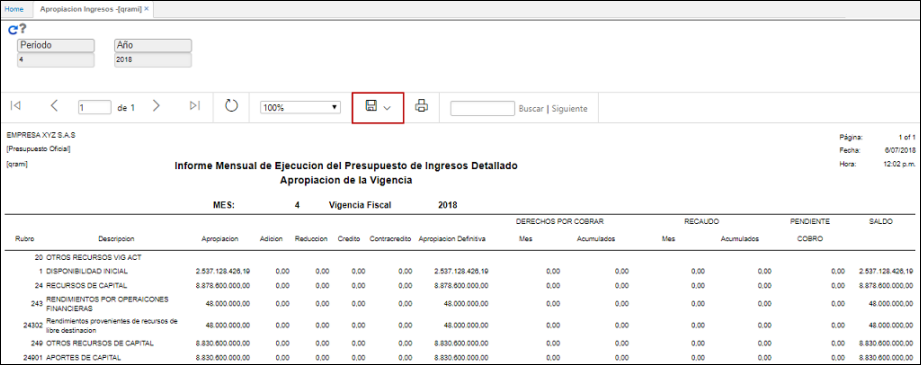
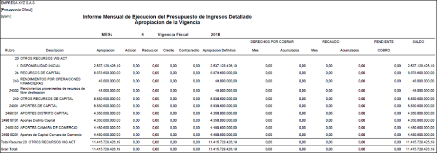

# QRAMI - Apropiación Ingresos

La aplicación QRAMI permite ver un reporte mensual de la apropiación de ingresos.  

Ingresamos a la aplicación y filtramos por mes y año. Damos click en el botón _Generar_.  

El reporte puede ser descargado en formato Excel, PDF y Word.   

_Reporte en formato PDF_.  

