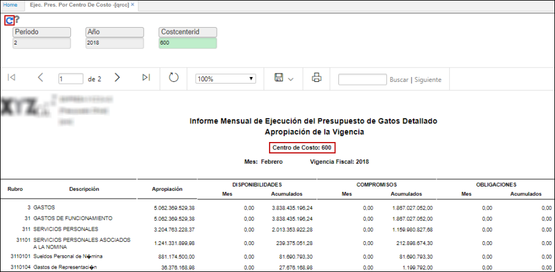
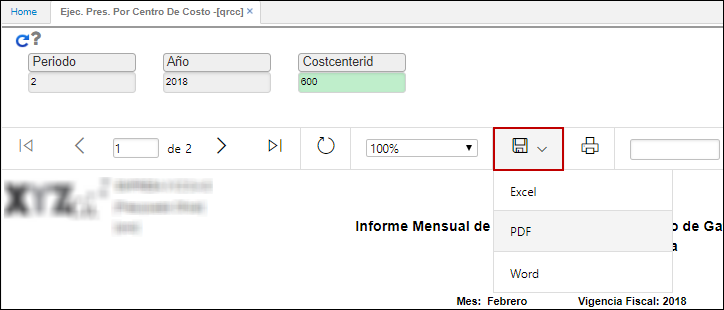

# Ejecución de Presupuesto por Centro de Costo - QRCC

El reporte **QRAMI** permite ver un informe mensual de ejecución presupuestal de gastos detallado por centro de costo.

Ingresamos a la aplicación y filtramos por mes, año y centro de costo. Damos click en el botón _Generar_.  

El reporte puede ser descargado en formato Excel, PDF y Word.   

_Reporte en formato PDF_.  

