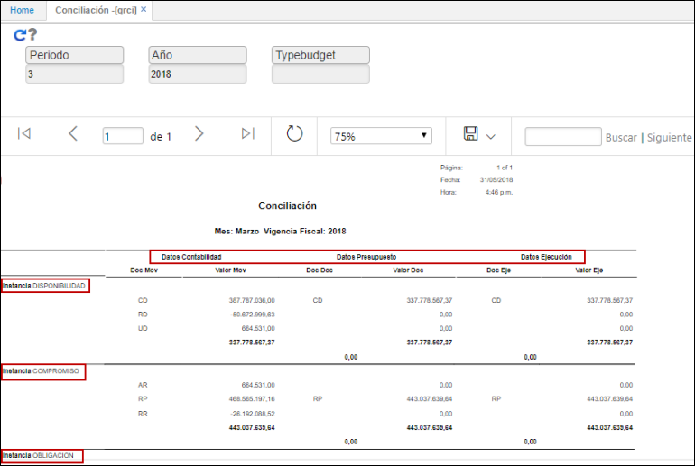

# QRCI - Conciliación

El reporte **QRCI** muestra la ejecución de conciliaciones cada instancia:  

* DISPONIBILIDAD
* COMPROMISO
* OBLIGACIÓN
* PAGADO

Veremos los datos en contabilidad, datos del presupuesto y los datos de ejecución.

Filtramos por mes y año.  

Al consultar podremos ver las conciliaciones realizadas entre los datos de contabilidad, presupuesto y ejecución.  

El reporte puede ser exportado en formato de Excel, PDF o Word.  

_Formato en PDF_.  

