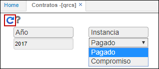
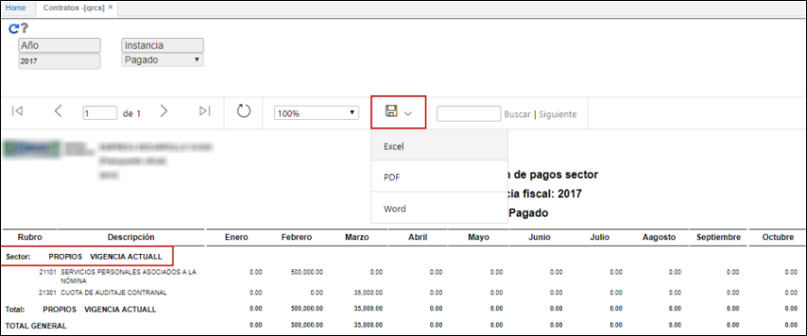
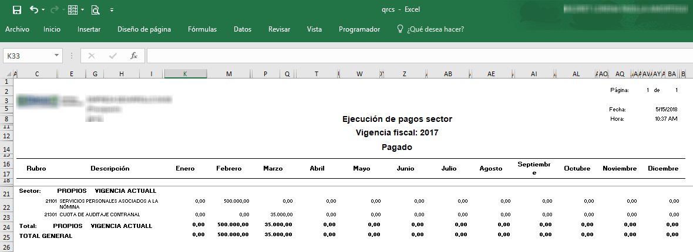

# QRCS - Contratos

El reporte QRCS permite ver un informe de ejecución de pagos por sector.

Ingresamos a la aplicación, filtramos por año y seleccionamos instancia: pagado o compromiso. Damos click en el botón _Generar_.  

El reporte puede ser descargado en formato Excel, PDF y Word.   

_Reporte en formato Excel_.  

