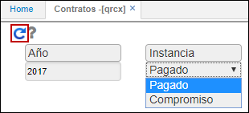
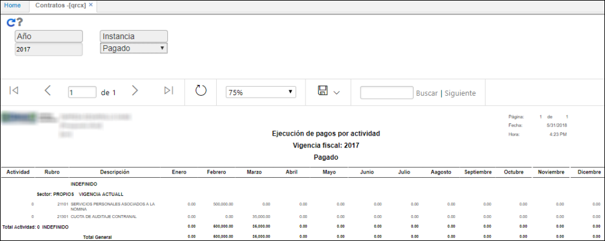
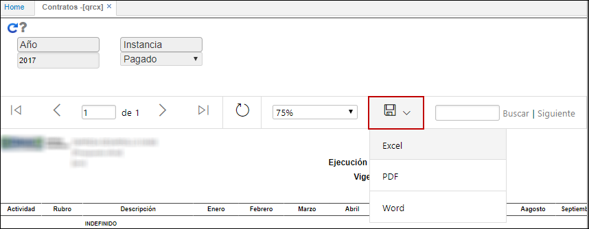

# Contratos - QRCX

El reporte **QRCX** muestra la ejecución de pagos por cada actividad de acuerdo con el contrato, es decir, que se visualiza el pago realizado mensualmente a cada una.  

Filtramos por año y seleccionamos si deseamos ver lo pagado o lo que está como compromiso.  

Al consultar podremos ver los pagos realizados en el año ingresado.  

El reporte puede ser exportado en formato de Excel, PDF o Word.  

