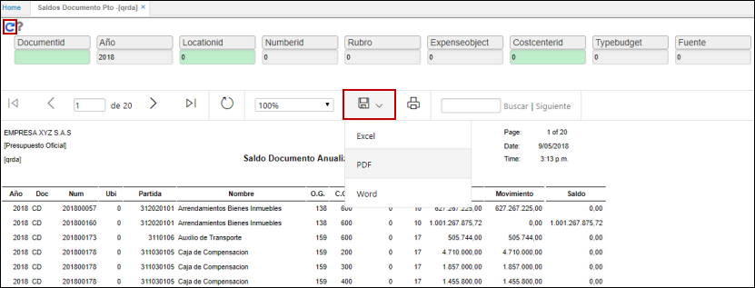

# QRDA - Saldo Documento Pto.

La aplicación QRDA permite ver un reporte de los saldos de los documentos que afectan el presupuesto.  

Ingresamos a la aplicación y filtramos por los datos deseados. Podemos realizar la consulta por número de registro específicamente. Si deseamos consultar los saldos de todos los documentos dejamos todos los campos en 0 y no especificamos documento.  

Damos click en el botón _Generar_. El reporte puede ser descargado en formato Excel, PDF y Word.   

