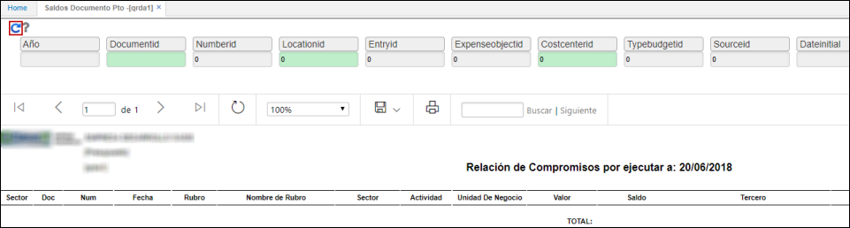
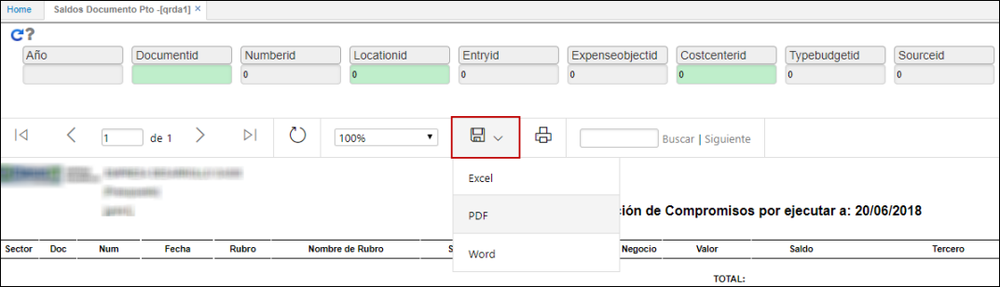
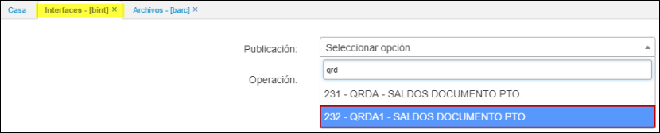

# Saldos Documento Pto. Anualizado - QRDA1

El reporte **QRDA1** permite ver un informe de los saldos por documentos anualizado.

Ingresamos a la aplicación, filtramos por las características necesarias y damos click en el botón _Generar_.  

El reporte puede ser descargado en formato Excel, PDF y Word.   

* Desde la interface **BINT** puede realizar la descarga de los Saldos de Presupuesto Anualizados **QRDA1**.  
* al realizar la exportacion podra evidenciar campos como: 'Codigo Alterno', 'Actividad', 'Unidad de Negocio' al reporte customizado **QRDA1**
* previa parametrizacion del **BARC** Archivos-**BPUB** Publicaciones.  

