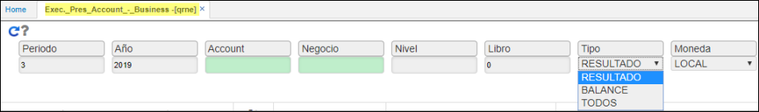
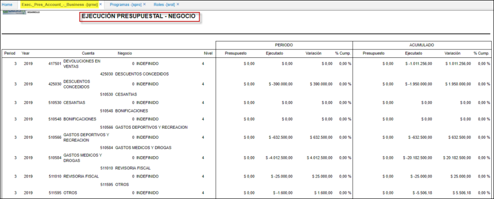

# QRNE - EJECUCIÓN PRESUPUESTAL - NEGOCIO

El Reporte **QRNE** visualiza la ejecución presupuestal por negocio.  
Muestra lo presupuestado desde la aplicación **QMOV** y lo ejecutado desde todas las aplicaciones que afecten las cuentas contables que han sido presupuestados.  

Ingresamos a la aplicación, filtramos por periodo, año, cuenta, negocio, nivel, libro, moneda; seleccionamos Tipo: 
* Resultado.  
* Balance.  
* Todos.  
 Damos click en el botón _Generar_.  

El reporte puede ser descargado en formato Excel, PDF y Word.   

