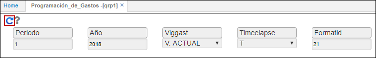

# Programación de Gastos - QRP1

Reporte que muestra la programación de gastos del proceso Chip Presupuestal generado previamente en la aplicación [**KPGF - Genera Formatos**](http://docs.oasiscom.com/Operacion/erp/contabilidad/kproceso/kpgf#proceso-chip-presupuestal).  

Consultamos por el periodo para el cual se generó el proceso en la aplicación KPGF, el año y el Id del Formato correspondiente a _Programación de Gastos_ (**21**).  

Al generar el reporte se visualizará la información.  

  
Descarga archivo plano reporte chip presupuestal, desde la interface **BINT.**  
Puede realizar la descarga según su publicación y programación de gastos o de ingresos.  

  

