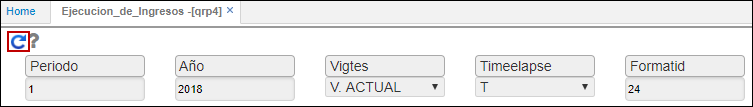

# Ejecución de Ingresos - QRP4 

Reporte que muestra la ejecución de ingresos del proceso Chip Presupuestal generado previamente en la aplicación [**KPGF - Genera Formatos**](http://docs.oasiscom.com/Operacion/erp/contabilidad/kproceso/kpgf#proceso-chip-presupuestal).  

Consultamos por el periodo para el cual se generó el proceso en la aplicación **KPGF,** el año y el Id del Formato correspondiente a _Ejecución de Ingresos_ (**24**).  

Al generar el reporte se visualizará la información.  

