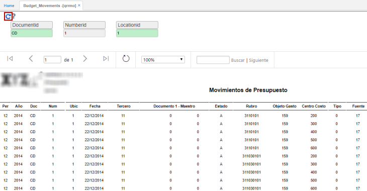

# QRRMO - Movimientos de Presupuesto

El reporte QRRMO permite ver un informe de movimientos de presupuesto.  

Ingresamos a la aplicación, filtramos por documento, número y ubicación. Damos click en el botón _Generar_.  

	

