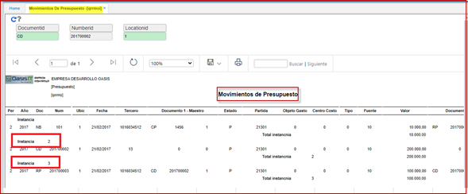

# Movimientos de Presupuesto - Instancia - QRRMOI

Reporte del módulo de presupuesto **QRRMOI**; agrupado por instancia, discrimina los movimientos presupuestales, según su partida, objeto gasto, centro costo, tipo, fuente. Se visualiza por periodo, año, ubicación del documento.  

