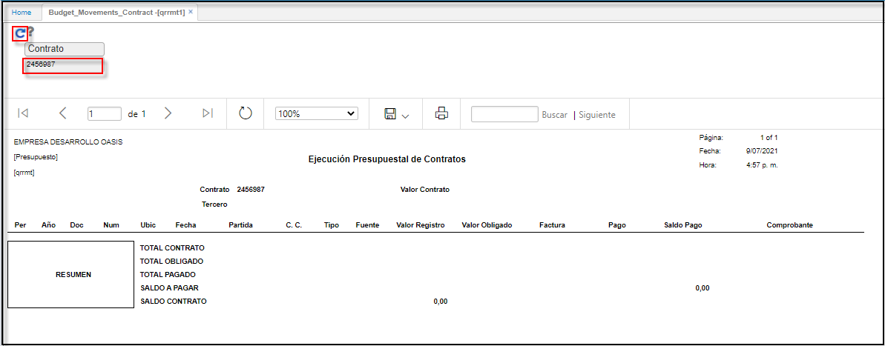

# Contrato Movimientos Presupuestarios  - QRRMT1

El reporte **QRRMT1** permite ver un informe de Contrato de movimientos presupuestarios.  

Ingresamos a la aplicación, filtramos por numero de contrato. Damos click en el botón _Generar_.  

	

