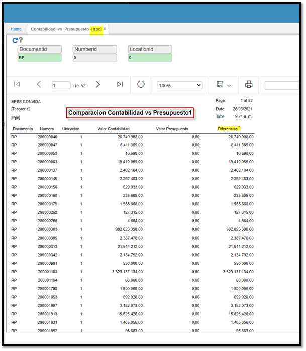

# Comparación Contabilidad vs Presupuesto1 - TRPC  

Reporte que establece las diferencias entre los dos módulos: contabilidad y el valor presupuestado oficial, parámetros de entrada documento, número y ubicación.  

Damos click en el botón _Generar_. El reporte puede ser descargado en formato Excel, PDF y Word.   

