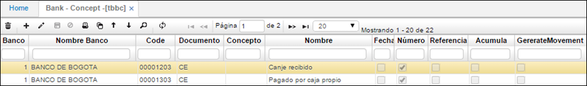

# BANK CONCEPT - TBBC

En esta aplicación se definen las parametrizaciones básicas necesarias para realizar el proceso de conciliación bancaria. Recuerde que esta parametrización debe ser acorde con la definida por el respectivo banco.  

Contiene los siguientes campos:  

**Banco:** Código del Banco, este código del banco viene de la aplicación bban.  
**Código:** Código interno del banco que identifica cada transacción realizada, estos códigos son utilizados al definir el archivo de conciliación.  
**Documento:** Documento realizado en el sistema y que corresponde al código interno del banco.  
**Concepto:** Concepto asociado al documento realizado en el sistema y que corresponde al código interno del banco.  
**Nombre:** Nombre del movimiento.  
**Fecha:** Indica si el movimiento se va conciliar por fecha.  
**Numero:** indica si el movimiento será conciliado por número de documento, generalmente para los cheques.  
**Acumula:** Indica si el movimiento es conciliado por el valor del mismo.  

