# Conciliación - TCON 

Esta aplicación nos ayuda a realizar las conciliaciones bancarias.  Para ello, se deben seguir los siguientes pasos:  

Se adiciona un nuevo registro.  En el campo _Documento_ el sistema trae las letras **_KT_** de conciliación bancaria, no le indicamos el _Número_ ya que el sistema lo da automáticamente, en el campo _Ubicación_ se busca por zoom la ubicación del banco al que le vamos a realizar el proceso, en los campos _Fecha original_ y _Fecha_ se escribe el rango de fechas del extracto bancario de donde se va a hacer la conciliación, en el campo _Concepto_ también el sistema arroja el concepto **_KT_** de conciliación bancaria.  No se llena ningún otro campo.  Se procede a guardar el registro.    

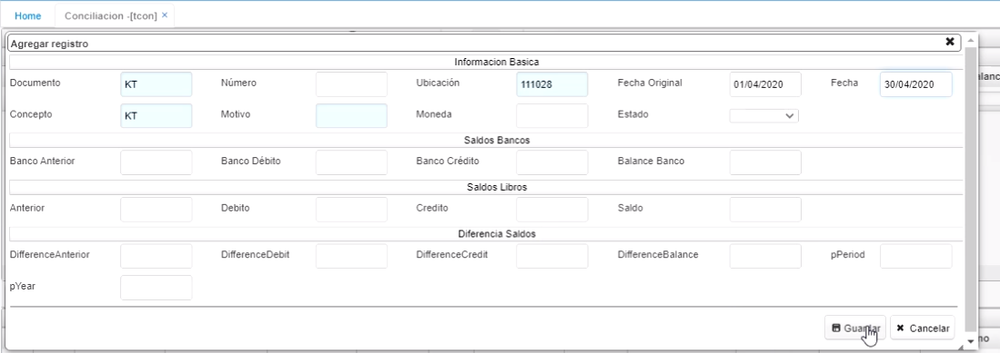    

Cuando guardo el registro, el sistema me trae en el detalle, en la pestaña _Libros_, los movimientos del periodo (adicionalmente, si tengo periodos anteriores sin conciliar, el sistema también me los va a mostrar).    

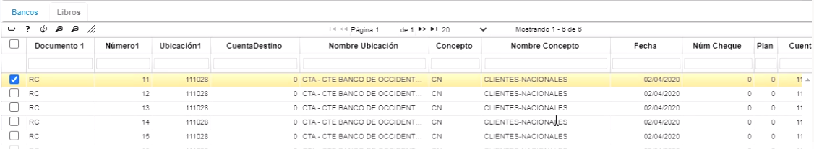  

En la pestaña _Bancos_, el sistema no me va a mostrar información puesto que es la persona que está realizando el proceso, quien debe colocar el extracto bancario.  Para esto, ingreso a la aplicación **Interfaces - BINT**, se busca la publicación correspondiente al extracto del banco que se va a conciliar, se busca el archivo plano que previamente fue descargado de la plataforma del banco (debe estar en formato txt) y le indico al sistema en qué documento me tiene que subir ese extracto, para esto se llenan los campos: _Documento_, _Número_, _Ubicación_ (esta información se origina del maestro del tcon), luego se hace click en _Aceptar y Ejecutar.    

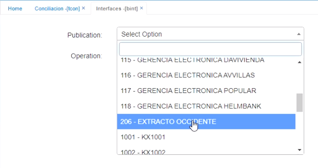    

  

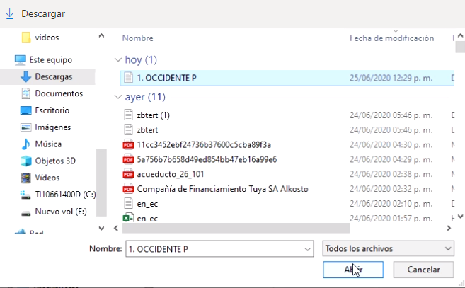  

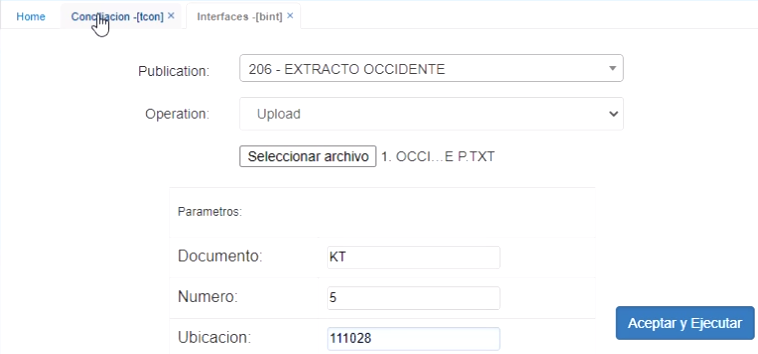  

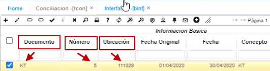  

Cuando sale el aviso de _Operación exitosa_ en el recuadro verde en la esquina superior derecha, vuelvo a la aplicación **TCON**, refresco o actualizo 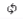 y ya en ese momento aparece en el detalle en la pestaña _Bancos_ el Extracto.  

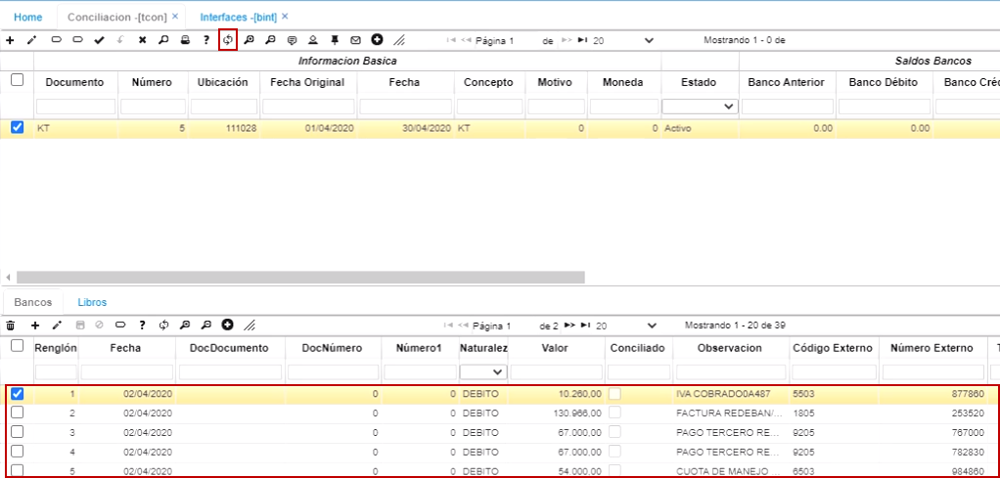

Cuando sube el extracto, el campo _Naturaleza_ va a aparecer con todos los movimientos como **_Débito_**.  Adicionalmente, en el campo _Código Externo_ aparecen unos códigos; estos códigos, que se relacionan con el manejo que hace el banco (cada uno de los movimientos viene a ser un código dentro del extracto).  Estos códigos deben ir parametrizados en una aplicación de OASIS que se llama **Bank-Concept - TBBC**.  

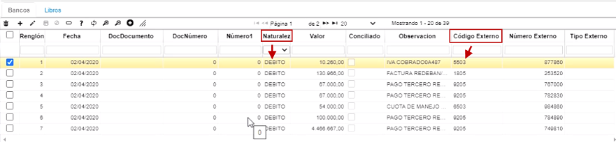  

En esta aplicación lo que se hace es consultar los códigos por cada uno de los bancos, códigos que manejan directamente los bancos y cada banco maneja su propio código.  En esta aplicación también hay un campo llamado _Documento_ el cual es muy importante porque determina la naturaleza, ya sea, _Débito_ o _Crédito_; para ello, se le debe asignar a cada código en ese campo, el documento que se utiliza dentro de OASIS para que cada código quede relacionado con un documento como se registra en el sistema; por ejemplo, cuando es un cheque pagado en oficina, el _Documento_ es **_CH_**, cuando es una consignación, el _Documento_ es **_CG_**, etc.  

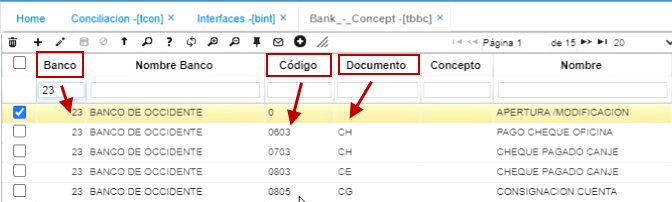  

Ahora, como sabe el sistema si es _Naturaleza_ **_Débito_** o **_Crédito_**?,  en la aplicación **Documentos - BDOC**, en el campo _Programa_, **Movimientos - TMOV**, se encuentran cada uno de los documentos que se utilizan en tesorería y si suma o resta; si suma el sistema lo tama como naturaleza débito y si resta, como naturaleza crédito.  De esa manera, el sistema sabe qué naturaleza toma en la conciliación.  Esta naturaleza la toma el sistema hasta el momento en que se le diga _Concilie automático_, de lo contario, va a quedar débito.  

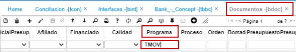  

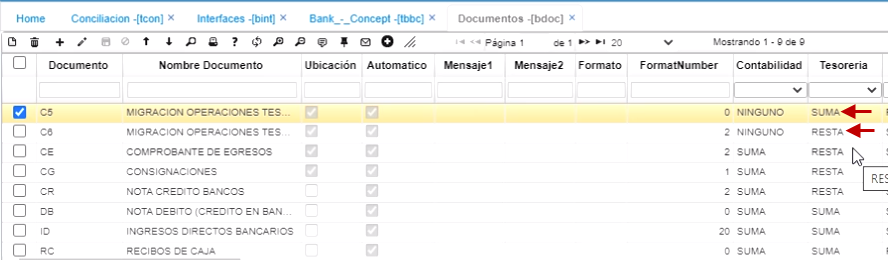 

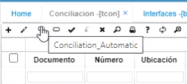

En el campo _Concepto_, no es necesario llenar todos los campos ya que en algunos movimientos se repite.  Para los únicos donde es necesario, es para aquellos movimientos que hacen parte de los gastos bancarios. Oasis tiene otro campo a la derecha que se llama _Generar Movimientos_ y para qué sirve este check?:  en la aplicación **Conciliación - TCON**, existe un botón que se llama _Generar Movimiento_ y este permite que el sistema genere automáticamente los registros de los gastos bancarios o de los rendimientos que el banco me de.  

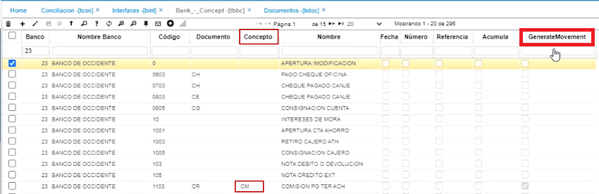

Para ello, en el ejemplo, se le asigna que las comisiones las debe registrar en el Campo _Documento_ como **_CR_** de Nota crédito y en el Campo _Concepto_ **_CM_** de Comisiones y con el check activado, se le dice que es un movimiento automático: esto quiere decir, que cuando se da click en el botón _Generar Movimiento_ de la aplicación **TCON**, el sistema va a crear el movimiento por estos conceptos de manera automática sin que el usuario tenga la necesidad de sumar o restar el valor de los gastos bancarios porque el sistema les brinda esta ayuda para que sea más fácil la conciliación.  Adicionalmente, también hay un campo llamado _Fecha_ donde si además de que el sistema tenga que conciliar los valores, yo quiero que me concilie por fecha, le doy click para que el check quede activo.  

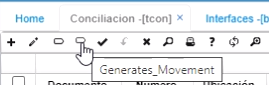  

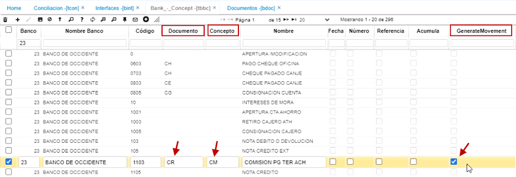  

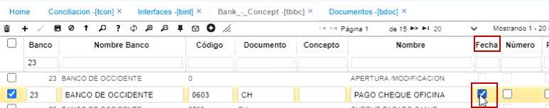  

Una vez realizada esta parametrización, como se necesita que el sistema genere unos movimientos automáticos, se debe tener creada una plantilla para que cuando el proceso se genere, identifique cuáles son las cuentas que tiene que afectar.  En la aplicación **Plantillas - BPLA** se encuentra un _Documento_ **_CR_** y un _Concepto_ **_CM_** que va a la _Naturaleza_ **_Crédito_** que _Depende_ de la **_Ubicación_** y la _Cuenta_ que debe afectar.  Se define igual cuando es para una nota débito con los correspondientes campos.  Una vez parametrizado en la aplicación **Plantillas - BPLA**, me dirijo a **TCON** y se le da click al botón _Generar Movimientos_ y aparece el aviso de _Transacción exitosa_.  

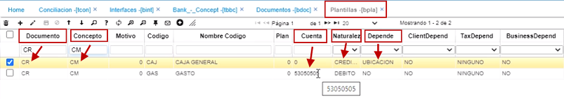  

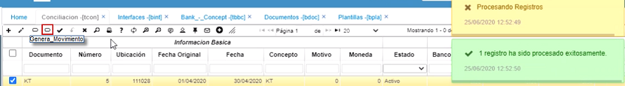

Ahora me dirijo a la aplicación **Movimientos - TMOV** y al consultar el _Documento_ **_CR_**, _Concepto_ **_CM_** con la _Ubicación_ que estoy conciliando, _Concepto_ **_CM_**, en _Estado_ **_Activo_** y encuentro que el sistema generó automáticamente los movimientos por cada gasto bancario que haya encontrado. Una vez genera este movimiento, hago click en procesar.  Si se tienen más documentos como notas débito o algún otro que se haya parametrizado a nivel de movimientos automáticos, el sistema también lo muestra y lo que debo hacer es validar pero luego se debe procesar.  

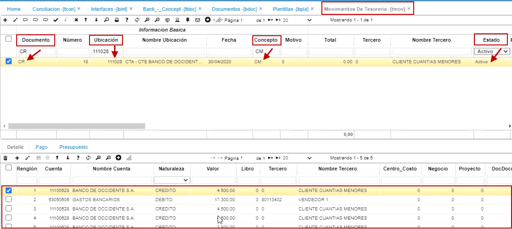  

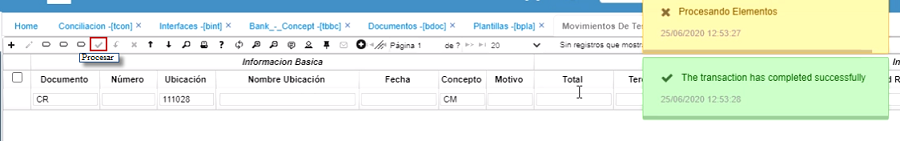  

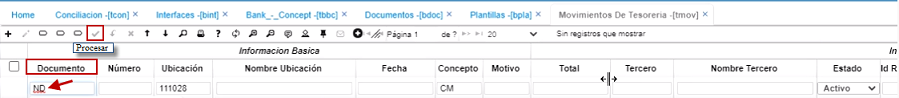
 

Después, se debe hacer click en el botón _Conciliación automática_, aparece el aviso de _Transacción exitosa_ y en el detalle aparece la  conciliación contra los valores que aparecen la pestaña _Libros_.  En dicha pestaña, al igual que en la pestaña _Bancos_ también hay un campo que se llama _Conciliado_, todos los valores aparecen con check, o sea que los concilió todos, mientras que en la pestaña _Bancos_ solo algunos.  

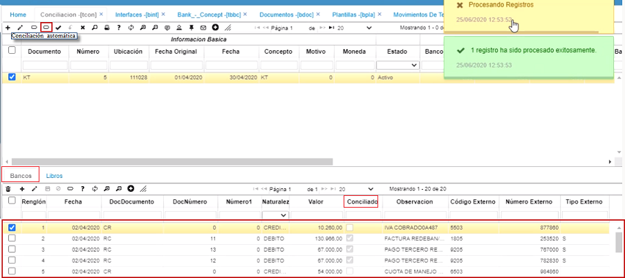  

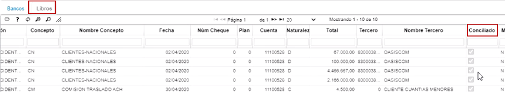  

Cuando se detectan realmente cuáles son las que quedan pendientes, se define si tendrían que hacerse los registros y una vez hechos, se le da click de nuevo en el botón _Conciliación automática_ para que el sistema termine de conciliar esas partidas. Si dichas partidas van a quedar pendientes por conciliar, se dejan tal cual y se da click en el botón _Procesar_.  Al mes siguiente, se debe ingresar a este sitio a conciliar las partidas de manera manual.  

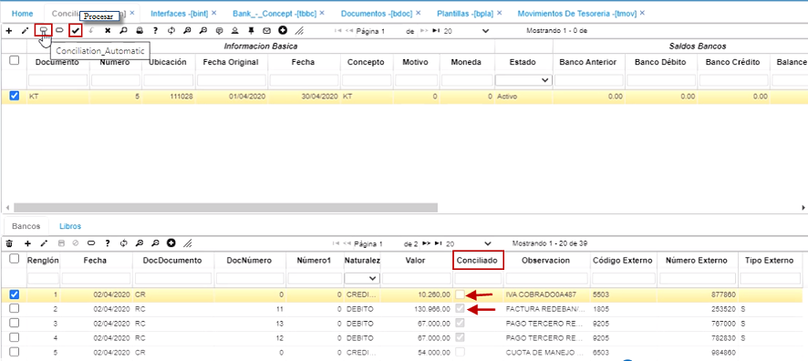   

Precisamente, el sistema tiene unos botones para conciliar manualmente; por ejemplo, una partida que quedó pendiente en la pestaña _Bancos_, cruza con una que hay en la pestaña _Libros_, entonces se busca, se selecciona y se oprime el botón _Conciliación manual_ para que haga el cruce entre los datos de ambas pestañas, esto podría ser en caso por ejemplo que haya $10.000.000 en la pestaña _Bancos_ y en la pestaña _Libros_ haya $5.000.000 y aparte $5.000.000, entonces el sistema no los reconoce como la misma transacción y por eso permite hacerlo de manera manual.

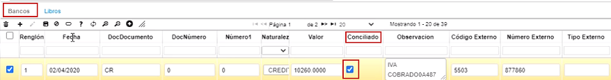  

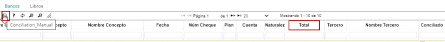  

Una vez realizado este proceso, se da click en el botón _Procesar_.  

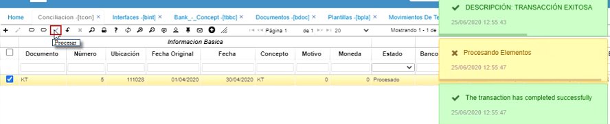  

En la ventana **Reportes**, se encuentra una aplicación llamada **Conciliación bancaria - TRCO**.  En ella, encuentro los campos: _Ubicación_, _Periodo_ y _Año_.  Si realizo la consulta con los datos correspondientes a esta conciliación, sale el reporte, donde dice lo que hay en _Bancos_ y no en _Libros_, cuáles son las partidas.  En la parte inferior aparece la cantidad real que hay en _Libros_ y hay que resaltar que en el renglón que dice _Diferencia entre Saldos_ debe aparecer en _Ceros_.  Este formato se puede exportar al formato que se desee o imprimir para que quede como soporte de la Conciliación bancaria.

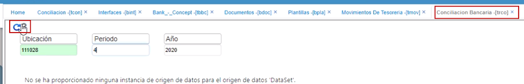  

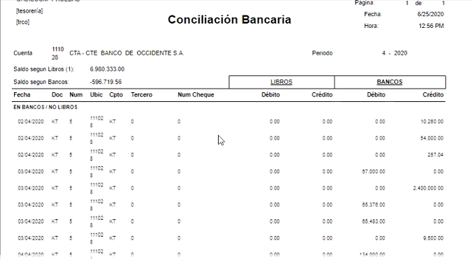  

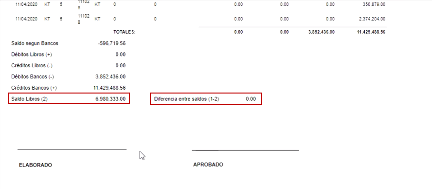  

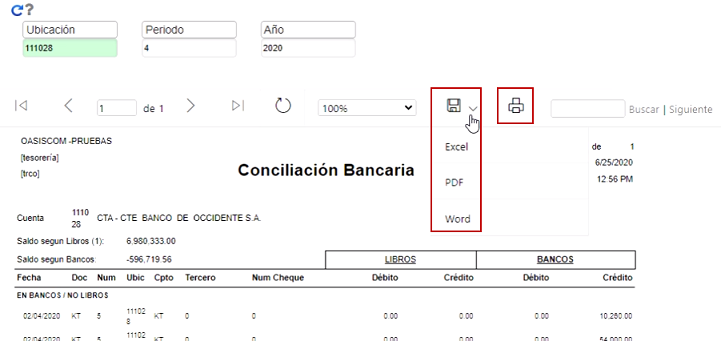  

