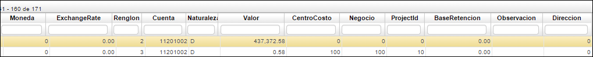

## Consulta de Movimientos - TMCM

Esta aplicación permite la consulta de los documentos que se han realizado en la opción **TMOV**, es una forma diferente de consultar estos documentos ya que no los muestra de forma separada en el maestro y el detalle, igualmente, permite filtrar por diferentes campos.

**Periodo:** Hace referencia al mes en el cual se elabora el comprobante.  
**Año:** Año al cual pertenece el periodo antes mencionado.  
**Documento:** Hace referencia al tipo de comprobante.  
**Número:** Número con el cual se generó el comprobante.  
**Ubicación:** Identificación de la ubicación de un punto de la empresa.  
**Tercero:** número de identificación del tercero.  
**Nombre Tercero:** Nombre del tercero consultado.  
**Concepto:** Identificación alfabética del concepto por el cual se genera el comprobante.  
**Cuenta Destino:** Identificación numérica de la ubicación a la cual se consignará (transferencia).  
**Fecha:** Fecha en la cual se genera el comprobante.  
**Total:** Valor por el cual se genera el comprobante.  
**Estado:** Estado de proceso en el cual se encuentra el comprobante, Activo, Procesado, Anulado.  

**Moneda:** Identificación numérica del tipo de moneda en la cual se genera el comprobante.  
**Exchange Rate:** Tipo de cambio.  
**Renglón:** Consecutivo generado por las diferentes cuentas que se manejan en el comprobante.  
**Cuenta:** Identificación numérica de las cuentas afectadas.  
**Naturaleza:** Hace referencia a la naturaleza de la cuenta si es débito o crédito.  
**Valor:** Valor numérico que afecta la cuenta según su naturaleza.  
**Centro Costo:** Identificación numérica del centro de costo al cual pertenece la cuenta.  
**Negocio:** Identificación numérica del negocio.  
**Projectld:** Identificación numérica del proyecto.  
**Base Retención:** Valor al cual se le debe liquidar la retención que se le aplica de acuerdo al concepto.  
**Observación:** Observación acerca del comprobante.  
**Dirección:** Corresponde a la dirección del tercero ingresado.  

