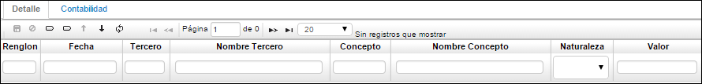
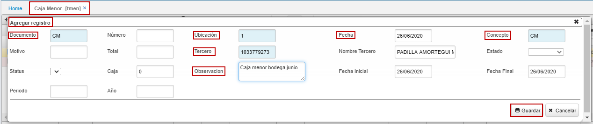
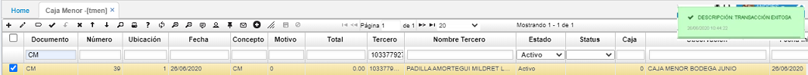
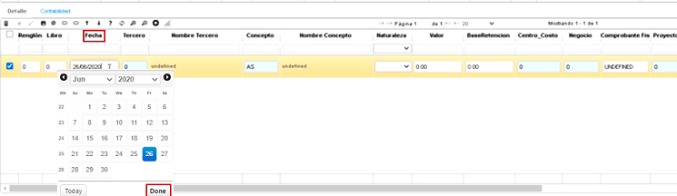
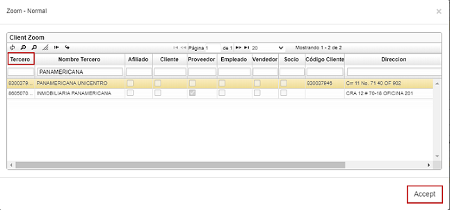
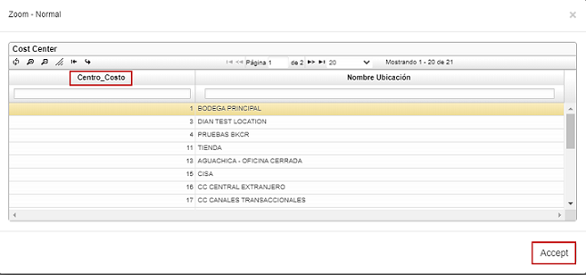
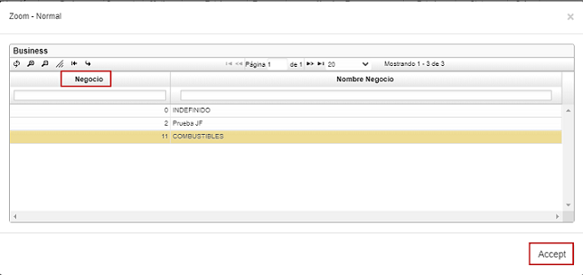
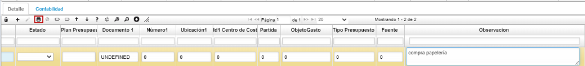
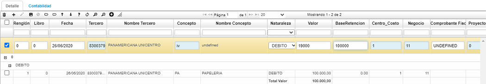

# Caja Menor - TMEN  

>+ [Proceso para crear la caja menor](http://docs.oasiscom.com/Operacion/erp/tesoreria/tmovimient/tmen#proceso-para-crear-la-caja-menor)  

Esta opción permite administrar los gastos cotidianos de la empresa, para ello se realiza un movimiento de Caja Menor, mediante un documento **CM**. 

Recuerde que este documento se realiza por la ubicación que haya sido designada para administrar estos recursos. 

No olvide ingresar el tercero responsable de la caja, el número de caja y la fecha inicial y final del movimiento, esta fecha corresponde al periodo abarcado por los diferentes desembolsos de caja, que se van a relacionar en el detalle del documento **CM**.

**Documento:** Iniciales del documento.  
**Número:** Número con el cual se ingresa al sistema el movimiento de la caja menor.  
**Ubicación:** Identificación numérica y nombre de la ubicación que genera el movimiento de caja menor.  
**Fecha:** Fecha en la cual se hace el movimiento de caja menor.  
**Concepto:** Concepto por el cual se va a registrar el movimiento en caja menor.  
**Motivo:** número que identifica un documento para casos especiales a nivel contable, se puede parametrizar los documentos por conceptos en la aplicación BDOC, los motivos se parametrizan desde la aplicación BPLA.  
**Total:** Valor por el cual se hace un crédito a la caja menor.
Tercero: número de identificación del tercero quien es responsable de la caja menor en determinada ubicación.  
**Nombre Tercero:** Nombre del tercero quien es responsable de la caja menor en determinada ubicación.  
**Estado:** Estado en el cual se encuentra el movimiento, Activo, Procesado, Anulado.  
**Caja:** Identificación numérica de la caja a la cual se genera el movimiento.  
**Observación:** Referente al movimiento de la caja menor.  
**Hora inicial:** Hora en la cual se asigna la caja menor a una ubicación.  
**Hora final:** Hora en la cual se procede a hacer el reembolso de la caja menor.  

En el detalle del documento **CM** se relacionan los conceptos que han sido designados para ser controlados por la Caja Menor. Antes se debe asegurar que los conceptos hayan sido creados en la opción **BDOC** y la contabilización se debe definir en la opción **BPLA**.  

**Renglón:** Consecutivo generado que se manejan en el comprobante.  
**Fecha:** Fecha en que se hizo el gasto a registrar en caja menor.  
**Tercero:** número de identificación del tercero al cual se carga el movimiento.  
**Nombre Tercero:** nombre del tercero al cual se carga el movimiento.  
**Concepto:** abreviaturas del concepto a registrar.  
**Nombre Concepto:** nombre del concepto a registrar.  
**Naturaleza:** Hace referencia a la naturaleza de la cuenta si es débito o crédito.  
**Valor:** Valor numérico que afecta la cuenta según su naturaleza.  

**Base Retención:** Valor al cual se le debe liquidar la retención que se le aplica de acuerdo al concepto.  
**Centro Costo:** Identificación del centro de costo al cual pertenece la cuenta.  
**Negocio:** Número de negocio al cual se carga el movimiento.  
**Projectld:** Identificación numérica del proyecto.  
**FiscalVoucher:** Número de autorización en caso que se utilice tarjeta.  
**Estado:** Estado de documento, activo, procesado, anulado.  
**Motivo:** número que identifica un documento para casos especiales a nivel contable, se puede parametrizar los documentos por conceptos en la aplicación BDOC, los motivos se parametrizan desde la aplicación BPLA.  
**Observación:** Referente al detalle del movimiento de la caja menor.  

## [Proceso para crear la caja menor](http://docs.oasiscom.com/Operacion/erp/tesoreria/tmovimient/tmen#proceso-para-crear-la-caja-menor)  

Se adiciona un nuevo registro (+) en el maestro.  En el campo _Documento_ se ingresa la opción **_CM_** de Caja menor, en el campo _Ubicación_ **_1_**, en el campo _Fecha_, el día que se le da apertura a la caja menor, en el campo _Concepto_ **_CM_** de caja menor, en el campo _Tercero_, a través del zoom, se busca a la persona responsable de la caja menor, en el campo _Observación_ colocamos el nombre de la caja menor o el destino para el cual va a ser utilizada y finalmente se da click en _Guardar_.  

  

 

En el detalle, se adiciona un nuevo registro (+), en el campo _Fecha_, se coloca la fecha del soporte que se tiene para registrar en la caja menor, en el campo _Tercero_, mediante el zoom se busca el nombre del tercero correspondiente a la factura que se va a registrar, en el campo _Concepto_, para este ejemplo, **_PA_** que corresponde a papelería, en el campo _Naturaleza_ **_Débito_**, en el campo _Valor_, el valor correspondiente a la factura, en el campo _Centro de costo_, el que corresponda que también se busca mediante el zoom porque ya está previamente parametrizado, el campo _Negocio_, se llena de igual manera que el campo Centro de Costo, y en el campo _Observación_, se coloca el nombre del concepto o motivo de la compra.  Luego, se hace click en _Guardar_.

  

  

  

  

  

  

Para hacer el registro del IVA, se realiza el mismo proceso; igual _fecha_, mismo _tercero_, _Concepto_ **_IV_**, se llena el campo _Base retención_, el mismo centro de costo y el mismo negocio y se da click en _Guardar_.  

  

Si se tienen más facturas por registrar, se registran de la misma forma y posteriormente se procesa el registro desde el maestro para confirmar la caja menor.  

  

En la parte inferior, en la pestaña _Contabilidad_, se puede ver el registro detallado de la transacción en relación a cuentas contables.  

  

Finalmente, se procede a realizar el reembolso de la _Caja Menor_.  

