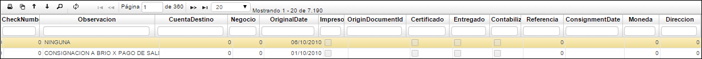
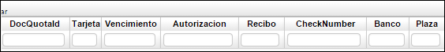
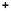
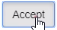
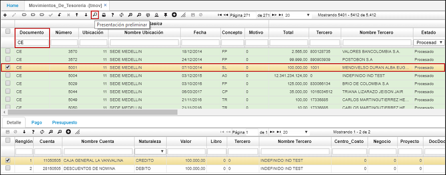

# Movimientos De Tesorería - TMOV

En esta aplicación se realizan los documentos que hayan sido creados para el programa **TMOV** en el básico de documentos **BDOC - Documentos**. Esta aplicación permite filtrar por los diferentes campos que contiene en el maestro, que es la parte superior de la aplicación; en ella se encuentran los datos básicos de cada documento.  

>+ [Comprobante de Egreso](http://docs.oasiscom.com/Operacion/erp/tesoreria/tmovimient/tmov#comprobante-de-egreso)
>+ [Vista Previa de Comprobantes de Egresos](http://docs.oasiscom.com/Operacion/erp/tesoreria/tmovimient/tmov#vista-previa-de-comprobantes-de-egresos)
>+ [Recibo de Caja](http://docs.oasiscom.com/Operacion/erp/tesoreria/tmovimient/tmov#recibo-de-caja)
>+ [Traslado de Conceptos](http://docs.oasiscom.com/Operacion/erp/tesoreria/tmovimient/tmov#traslado-de-conceptos)

**Documento:** Tipo de documento a registrar.  
**Número:** Consecutivo de documento.  
**Ubicación:** Ubicación (empresa) donde se quiere registrar el documento.  
**Fecha:** Fecha en la cual se realiza la transacción.  
**Concepto:** Iniciales del concepto por el cual se desea realizar el documento.  
**Motivo:** número que identifica un documento para casos especiales a nivel contable, se puede parametrizar los documentos por conceptos en la aplicación BDOC, los motivos se parametrizan desde la aplicación BPLA.  
**Total:** Valor total del movimiento a realizar.  
**Tercero:** Número de identificación del tercero al cual se carga el movimiento.  
**Nombre Tercero:** Nombre del tercero al cual se carga el movimiento.  
**Estado:** Estado de documento: Activo, Procesado, Anulado.  
**Empleado:** Identificación numérica del empleado.  
**Check Number:** Identificación del cheque.  
**Observación:** Campo que se utiliza para dar una breve explicación del comprobante a realizar.  
**Cuenta Destino:** Identificación numérica de la empresa a la cual se consignará (transferencia).  
**Negocio:** Número de negocio al cual se carga el movimiento.  
**OriginalDate:** al diligenciar el campo FECHA automáticamente actualiza este campo.  
**Impreso:** Si aplica cuando se genera el cheque u otro comprobante.  
**Certificado:** Este campo se activa junto con el de pago se utiliza cuando se cancela la obligación.  
**Entregado:** Aplica cuando se genera el cheque u otro comprobante.  
**ConsignmentDate:** Fecha en la cual se hace el pago de la obligación.  
**Moneda:** Tipo de moneda en la cual se hace el movimiento.  
**Dirección:** Hace referencia a la dirección del tercero.  

En el detalle se muestra la contabilización de cada documento, esta contabilización es insertada automáticamente por el sistema dependiendo de la parametrización que se haya definido para el documento en la opción **BPLA - Plantillas**.  

**Renglón:** Consecutivo que se genera cuando se manejan varias cuentas en un comprobante.  
**Cuenta:** Identificación numérica de las cuentas afectadas.  
**Naturaleza:** Hace referencia a la naturaleza de la cuenta si es débito o crédito.  
**Valor:** Valor numérico que afecta a la cuenta según su naturaleza.  
**Tercero:** Identificación numérica del tercero.  
**Centro Costo:** Identificación del centro de costo al cual pertenece la cuenta.  
**Negocio:** Identificación numérica del negocio.  
**Projectld:** Identificación numérica del proyecto.  
**DocDocumento:** Especificación del documento que va a afectar o cruzar, este campo posee zoom; debe dar doble clic y emite los documentos a seleccionar como se ilustra; el sistema realiza la sumatoria de los documentos. (Previa parametrización **SPRO** para que realice la suma).    
  

**DocNumberld:** Registrando el DocDocumento este campo se diligencia automáticamente.  
**DocLocationld:** Este campo, registrando el DocDocumento este campo se diligencia automáticamente.  
**Base retención:** Valor al cual se le debe liquidar la retención que se le aplica de acuerdo al concepto.  

**Plan:** En este campo se colocará el código del plan del cual se tomarán las cuentas.  
**Libro:** Número de libro según parametrización en Libros (KLIB).  
**Moneda:** Tipo de moneda en la cual se hace el movimiento.  
**Valor1:** Valor en la moneda que se realizó originalmente la transacción.  

La pestaña **Pago** indica la forma en que se está cancelando el documento.  

**Renglón:** Consecutivo que se genera cuando se manejan varias cuentas en un comprobante.  
**Forma pago:** Hace referencia a la manera como se cancela la obligación (efectivo, cheque entre otros).  
**Valor:** Cantidad por la cual se hace el pago.  
**BaseTax:** Base del impuesto.  
**DocNumberld:** Número del documento.  
**DocLocationld:** Ubicación del documento.  

**Autorización:** Este campo se utiliza cundo se autoriza la entrega del cheque a una persona.  
**Check Number:** Identificación del cheque, se utiliza cuando la forma de pago de la obligación es en cheque.  
**Banco:** Identificación numérica del banco al cual pertenece el cheque.  
**Plaza:** Ciudad en la que genera el cheque.  

## [Comprobante de Egreso](http://docs.oasiscom.com/Operacion/erp/tesoreria/tmovimient/tmov#comprobante-de-egreso)

Los comprobantes de egreso se utilizan para registrar todas aquellas transacciones, ya sea un egreso, salida de caja o cuentas bancarias. 

 

Damos clic  para crear un nuevo registro. 

 

**Documento:** CE comprobante de egreso.   
**Numero:** Numero automático que el sistema genera como consecutivo de nuestros documentos.   
**Ubicación:** Ingresar o escoger el Banco o la Caja de donde va a salir el dinero.   
**Concepto:** Para el ejemplo se coloca CP que corresponde a cuentas por pagar, también podemos utilizar otros conceptos según el pago que vamos a realizar.   
**Tercero:** Elegir el proveedor respectivo.  
**Total:** Se digita el valor correspondiente al egreso.   
**Observación:** Descripción adicional.  

Luego de llenar los campos correspondientes, guardamos los cambios. 

El sistema nos genera automáticamente unas cuentas, estas son sugeridas por el sistema, que se dejan parametrizadas en el Básico de Plantillas. 

Estas cuentas sugeridas las podemos modificar o podemos agregar registros, dependiendo el tipo de transacción que se requiera realizar. 

**Nota:** La cuenta Banco no se debe modificar,  ya que esta se encuentra relacionada directamente a la ubicación, si se desea cambiar esta cuenta el sistema nos va a generar un mensaje de control indicando que la cuenta contable no corresponde a la ubicación con la que estamos creando el documento.

Luego de causar una factura a proveedor, se realiza un cruce en el campo *DocDocumento* 

Esto con el fin de que nos quede la trazabilidad de los documentos que vamos cancelando.

 Escogemos la cuenta que vamos a cancelar. 

Luego de agregar el registro damos clic  

Ya nos queda relacionada nuestra cuenta por pagar, una vez nos queda las partidas iguales, débitos y créditos procesamos la información. 

De esta manera nuestra transacción queda lista y estamos afectando nuestro módulo de tesorería con la salida de este dinero.

## [Vista Previa de Comprobantes de Egresos](http://docs.oasiscom.com/Operacion/erp/tesoreria/tmovimient/tmov#vista-previa-de-comprobantes-de-egresos)

La aplicación **TMOV** permite obtener una vista previa de los comprobantes de egresos (CE), para ello, se debe parametrizar el número de formato para el documento **CE** en la aplicación [**BDOC - Documentos**](http://docs.oasiscom.com/Operacion/common/bsistema/bdoc#parametrizaci%C3%B3n-de-formatos-de-impresi%C3%B3n). Este número de formato lo obtenemos al consultar por programa (tmov) en la aplicación [**SPRO - Programas**](http://docs.oasiscom.com/Operacion/cloud/smetadata/spro#parametrizaci%C3%B3n-de-formatos-de-impresi%C3%B3n). El formato se denomina _dw_i_movimiento_tes_pre_. (_Ver aplicaciones BDOC y SPRO_).  

Para ir a la vista previa consultamos por el documento **CE** y seleccionamos el registro a visualizar. Damos clic en el botón . 

Obtendremos la siguiente vista previa.  

* Se ajusta la vista previa del **TMOV**  Dusakawi para el escenario donde tenga FS y glosa.  

* Otro formato del TMOV en su vista preliminar se visualizara así, donde se totalizan sus valores por cada uno de sus libros.  

El formato podrá ser exportado en formato de Excel, PDF o Word.  

_PDF_

## [Recibo de Caja](http://docs.oasiscom.com/Operacion/erp/tesoreria/tmovimient/tmov#recibo-de-caja)

El recibo de Caja se usa para registrar todos aquellos dineros que se reciben a diario, ya sea en cuentas bancarias o directamente de caja. 

 

Damos clic  para crear un nuevo registro. 

**Documento:** En este caso seleccionamos RC Recibo de caja.   
**Numero:** Numero automático que el sistema genera como consecutivo de nuestros documentos.   
**Ubicación:** Ingresar o escoger el Banco o la caja que se requiera.   
**Concepto:** Para el ejemplo se coloca CN que corresponde a clientes nacionales, también podemos utilizar otros conceptos esto depende el concepto por el que estemos recibiendo el dinero.   
**Tercero:** Ingresar el NIT o la cedula del cliente o de la persona que nos esté entregando el dinero.  
**Total:** Se digita el valor que se está recibiendo.   
**Observación:** Descripción adicional. 
**Fecha:** Se recibe el dinero.  

Luego de llenar los campos correspondientes, guardamos los cambios. 

De acuerdo con la parametrización que se realiza previamente en el básico de plantillas, el sistema nos sugiere unas cuentas, estas cuentas sugeridas se pueden modificar u obtener más registros, dependiendo el tipo de transacción que se requiera realizar.

**Nota:** La cuenta Banco no se debe modificar,  ya que se encuentra relacionada directamente a la ubicación con la que se está creando el documento, si se desea cambiar esta cuenta, el sistema va a generar un mensaje de control indicando que la cuenta contable no corresponde a la ubicación del documento.

En la cuenta por cobrar que se requiere cancelar, o se recibe el dinero, en el campo *DocDocumento* se selecciona la factura que se va a cancelar. 

Luego de seleccionar la factura a cancelar, aceptamos el proceso 

Si es un recaudo que recibimos y es por concepto de un anticipo, no es necesario realizar el cruce a la trazabilidad en el campo *DocDocumento* esta opción le indica al documento que la factura se está cancelando, pero en dado caso de no tenerlo, se puede hacer el registro y omitimos el paso de  la relación del documento.

Una vez ingresamos esta información y se verifiquen los datos correspondientes, se procesa el documento.  

Luego de procesar el documento, automáticamente cambia el estado del documento que anteriormente estaba activo.

## [Traslado de Conceptos](http://docs.oasiscom.com/Operacion/erp/tesoreria/tmovimient/tmov#traslado-de-conceptos)

Este se realiza 

