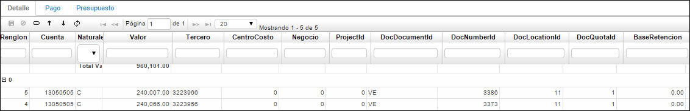
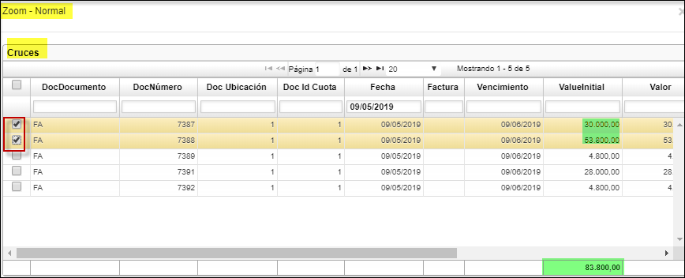
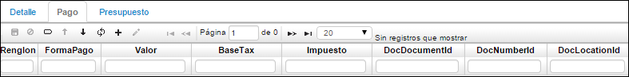
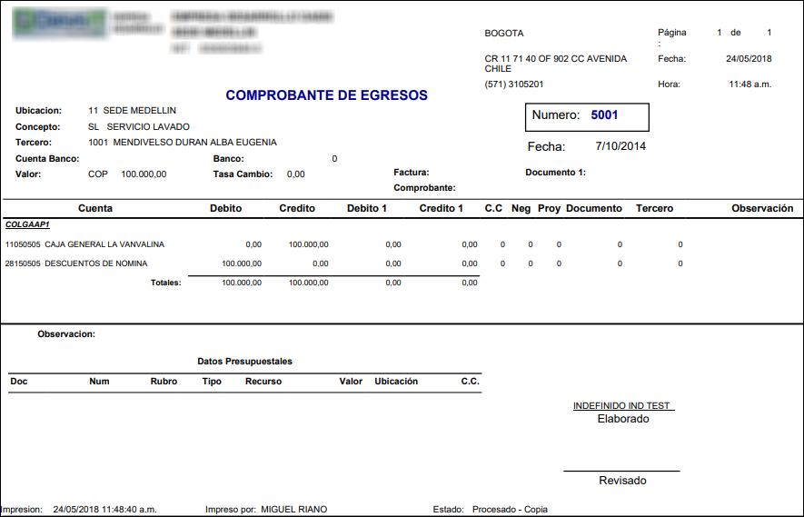

## Movimientos De Tesorería - TMOV

En esta aplicación se realizan los documentos que hayan sido creados para el programa **TMOV** en el básico de documentos **BDOC - Documentos**. Esta aplicación permite filtrar por los diferentes campos que contiene en el maestro, que es la parte superior de la aplicación; en ella se encuentran los datos básicos de cada documento.  

**Documento:** Tipo de documento a registrar.  
**Número:** Consecutivo de documento.  
**Ubicación:** Ubicación (empresa) donde se quiere registrar el documento.  
**Fecha:** Fecha en la cual se realiza la transacción.  
**Concepto:** Iniciales del concepto por el cual se desea realizar el documento.  
**Motivo:** número que identifica un documento para casos especiales a nivel contable, se puede parametrizar los documentos por conceptos en la aplicación BDOC, los motivos se parametrizan desde la aplicación BPLA.  
**Total:** Valor total del movimiento a realizar.  
**Tercero:** Número de identificación del tercero al cual se carga el movimiento.  
**Nombre Tercero:** Nombre del tercero al cual se carga el movimiento.  
**Estado:** Estado de documento: Activo, Procesado, Anulado.  
**Empleado:** Identificación numérica del empleado.  
**Check Number:** Identificación del cheque.  
**Observación:** Campo que se utiliza para dar una breve explicación del comprobante a realizar.  
**Cuenta Destino:** Identificación numérica de la empresa a la cual se consignará (transferencia).  
**Negocio:** Número de negocio al cual se carga el movimiento.  
**OriginalDate:** al diligenciar el campo FECHA automáticamente actualiza este campo.  
**Impreso:** Si aplica cuando se genera el cheque u otro comprobante.  
**Certificado:** Este campo se activa junto con el de pago se utiliza cuando se cancela la obligación.  
**Entregado:** Aplica cuando se genera el cheque u otro comprobante.  
**ConsignmentDate:** Fecha en la cual se hace el pago de la obligación.  
**Moneda:** Tipo de moneda en la cual se hace el movimiento.  
**Dirección:** Hace referencia a la dirección del tercero.  

En el detalle se muestra la contabilización de cada documento, esta contabilización es insertada automáticamente por el sistema dependiendo de la parametrización que se haya definido para el documento en la opción **BPLA - Plantillas**.  

**Renglón:** Consecutivo que se genera cuando se manejan varias cuentas en un comprobante.  
**Cuenta:** Identificación numérica de las cuentas afectadas.  
**Naturaleza:** Hace referencia a la naturaleza de la cuenta si es débito o crédito.  
**Valor:** Valor numérico que afecta a la cuenta según su naturaleza.  
**Tercero:** Identificación numérica del tercero.  
**Centro Costo:** Identificación del centro de costo al cual pertenece la cuenta.  
**Negocio:** Identificación numérica del negocio.  
**Projectld:** Identificación numérica del proyecto.  
**DocDocumento:** Especificación del documento al cual va afectar o cruzar, este campo posee zoom, debe de dar doble clic y emite los documentos a seleccional, como se ilustra.  
  

**DocNumberld:** Registrando el DocDocumento este campo se diligencia automáticamente.  
**DocLocationld:** Registrando el DocDocumento este campo se diligencia automáticamente.  
**Base retención:** Valor al cual se le debe liquidar la retención que se le aplica de acuerdo al concepto.  

**Plan:** En este campo se colocará el código del plan del cual se tomarán las cuentas.  
**Libro:** Número de libro según parametrización en Libros (KLIB).  
**Moneda:** Tipo de moneda en la cual se hace el movimiento.  
**Valor1:** Valor en la moneda que se realizó originalmente la transacción.  

La pestaña **Pago** indica la forma en que se está cancelando el documento.  

**Renglón:** Consecutivo que se genera cuando se manejan varias cuentas en un comprobante.  
**Forma pago:** Hace referencia a la manera como se cancela la obligación (efectivo, cheque entre otros).  
**Valor:** Cantidad por la cual se hace el pago.  
**BaseTax:** Base del impuesto.  
**DocNumberld:** Número del documento.  
**DocLocationld:** Ubicación del documento.  

**Autorización:** Este campo se utiliza cundo se autoriza la entrega del cheque a una persona.  
**Check Number:** Identificación del cheque, se utiliza cuando la forma de pago de la obligación es en cheque.  
**Banco:** Identificación numérica del banco al cual pertenece el cheque.  
**Plaza:** Ciudad en la que genera el cheque.  

## [Vista Previa de Comprobantes de Egresos](http://docs.oasiscom.com/Operacion/erp/tesoreria/tmovimient/tmov#vista-previa-de-comprobantes-de-egresos)

La aplicación TMOV permite obtener una vista previa de los comprobantes de egresos (CE), para ello, se debe parametrizar el número de formato para el documento **CE** en la aplicación [**BDOC - Documentos**](http://docs.oasiscom.com/Operacion/common/bsistema/bdoc#parametrizaci%C3%B3n-de-formatos-de-impresi%C3%B3n). Este número de formato lo obtenemos al consultar por programa (tmov) en la aplicación [**SPRO - Programas**](http://docs.oasiscom.com/Operacion/cloud/smetadata/spro#parametrizaci%C3%B3n-de-formatos-de-impresi%C3%B3n). El formato se denomina _dw_i_movimiento_tes_pre_. (_Ver aplicaciones BDOC y SPRO_).  

Para ir a la vista previa consultamos por el documento **CE** y seleccionamos el registro a visualizar. Damos click en el botón .  

Obtendremos la siguiente vista previa.  

* Otro formato del TMOV en su vista prelimanar se visualizara asi, donde se totalizan sus valores por cada uno de sus libros.  

El formato podrá ser exportado en formato de Excel, PDF o Word.  

_PDF_

