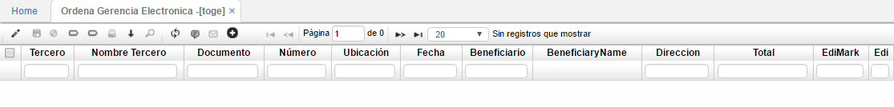

## Ordena Gerencia Electrónica - TOGE

Permite definir los documentos que se utilizarán en el momento de generar la gerencia electrónica.  
Se define como incorporación de tecnologías de la información y las comunicaciones en la administración pública y privada. Esto tiene dos vertientes: desde un punto de vista intraorganizativo transformar las oficinas tradicionales, convirtiendo los procesos en papel, en procesos electrónicos.

* se relacionan los siguientes campos:

**Tercero:** Número de identificación del tercero al cual se carga el movimiento.  
**Nombre Tercero:** Nombre del tercero al cual se carga el movimiento.  
**Documento:** Identifica el tipo de transacción.  
**Numero:** Numero del documento correspondiente a la transacción.  
**Ubicación:** Identificación numérica de la ubicación que genera el movimiento.  
**Fecha:** Fecha en que se hizo la transacción.  
**Beneficiario:** número de identificación, si existe, de un tercero el cual sea el beneficiario de la transacción.  
**Nombre beneficiario:** nombre del beneficiario de la transacción.  
**Direccion:** Campo adicionado con la finalidad de seleccionar el destino de pago.  
**Total:** Valor total de la transacción.  
**EdiMark:** Permite seleccionar los documentos a los cuales se desea realizar la transacción.  
**Edi:** Muestra los documentos que ya se realizó la transacción.  

