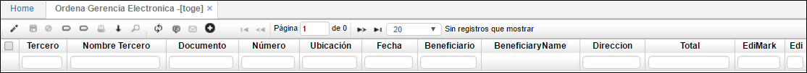
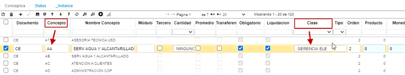

# Ordena Gerencia Electrónica - TOGE  

>+ [Proceso de Gerencia Electrónica](http://docs.oasiscom.com/Operacion/erp/tesoreria/tmovimient/toge#proceso-de-gerencia-electrónica)

Permite definir los documentos que se utilizarán en el momento de generar la gerencia electrónica.  
Se define como incorporación de tecnologías de la información y las comunicaciones en la administración pública y privada. Esto tiene dos vertientes: desde un punto de vista intraorganizativo transformar las oficinas tradicionales, convirtiendo los procesos en papel, en procesos electrónicos.

* se relacionan los siguientes campos:

**Tercero:** Número de identificación del tercero al cual se carga el movimiento.  
**Nombre Tercero:** Nombre del tercero al cual se carga el movimiento.  
**Documento:** Identifica el tipo de transacción.  
**Numero:** Numero del documento correspondiente a la transacción.  
**Ubicación:** Identificación numérica de la ubicación que genera el movimiento.  
**Fecha:** Fecha en que se hizo la transacción.  
**Beneficiario:** número de identificación, si existe, de un tercero el cual sea el beneficiario de la transacción.  
**Nombre beneficiario:** nombre del beneficiario de la transacción.  
**Direccion:** Campo adicionado con la finalidad de seleccionar el destino de pago.  
**Total:** Valor total de la transacción.  
**EdiMark:** Permite seleccionar los documentos a los cuales se desea realizar la transacción.  
**Edi:** Muestra los documentos que ya se realizó la transacción. 

## [Proceso de Gerencia Electrónica](http://docs.oasiscom.com/Operacion/erp/tesoreria/tmovimient/toge#proceso-de-gerencia-electrónica)  

El fin de este proceso es que OASISCOM permita generar el archivo plano de los diferentes pagos que se realizan a terceros y que este archivo plano sirva para subirlo directamente a la plataforma del banco para realizar los pagos pertinentes.  

Se comienza haciendo una parametrización para que este proceso funcione.  Primero, se ingresa a la aplicación **Ubicaciones Organización - BUBI**; aquí se consulta la ubicación del banco del que necesitamos se genere el archivo plano.  Para este ejemplo, se va a utilizar una ubicación del Banco de Bogotá - cuenta corriente, este, debe tener marcado un campo que se llama _Factura electrónica_ con el número **_1_**; si no está marcado con el 1, no funciona.    

  

  

También es importante, que en la aplicación **Terceros - BTER**, en el detalle, las cuentas bancarias de los proveedores o personas a quienes se les vaya a realizar algún pago, estén relacionadas, sino, el sistema no va a saber de dónde tomar la información para generar el archivo plano.    

  

También se debe ingresar a la aplicación **Documentos - BDOC**, se busca por el campo _Documento_ la opción **_CE_** de Comprobante de egresos y en el detalle se indica cuáles conceptos se van a utilizar para generar el archivo de _Gerencia electrónica_.  En el ejemplo, se marca que el _Concepto_ **_AA_** de Servicio agua y alcantarillado va a ser parte del proceso de _Gerencia electrónica_ y así mismo, también el _Concepto_ **_CP_** de Cuentas por pagar, va a estar marcado en el campo _Clase_ como **Gerencia electrónica**.  Si está marcado de esta manera, el sistema va a identificar que esos conceptos son los que se van a ver en la aplicación para generar el archivo plano para pago a terceros.  

  

  

  

Después de realizada la parametrización y teniendo en cuenta que debe haber una cuenta por pagar que se genera en la aplicación **Movimientos - TMOV** y el pago se realizará a través de esta aplicación.  En esta aplicación debe estar creado un _Documento_ **_CE_** de Comprobante de egreso con un _Concepto_ **_CP_** de Cuentas por pagar.  Si para el ejemplo, se tiene ese documento CE, con la Ubicación del Banco de Bogotá - cuenta corriente y Concepto CP, el sistema ya identifica que este documento para esa ubicación y ese concepto, aplica para el proceso de _Gerencia electrónica_.  

  

Ahora sí, desde esta aplicación **TOGE**, se consulta por _Documento_ **_CE_** y aquí aparecen todos los _documentos_ por comprobante de egreso con las Ubicaciones que estén marcadas con _Gerencia electrónica_ y en este, aunque no muestra el _Concepto_, el sistema lo valida para poder mostrar aquí la información.  Por ejemplo, para la ilustración, Comprobante de egreso 1 para la Ubicación del ejemplo, es la misma que se ve en **TMOV**; como tiene concepto CP y el Concepto CP está marcado como Clase _Gerencia electrónica_, entonces lo muestra en **TOGE** y el paso a seguir es marcar lo que se quiere generar en el archivo plano; si es todo, se marca en el campo superior, sino se marca en el que está al lado del registro.  Cuando se selecciona, se le da click en el botón _Marcar_.  

  

  

En la siguiente pantalla que aparece, se activa el flag de _Modificar_ y el de _Gerencia electrónica_ y luego hago click en _Guardar.  

  

En la parte derecha, verifico que el campo _Gerencia electrónica_ tiene el flag activado y esto es lo que le indica al sistema que es lo que se quiere ordenar.  

  

Posteriormente, ingreso a una aplicación que se llama **Interfaces - BINT**, se busca la _Publicación_ **_Gerencia electrónica Bogotá_** (para este ejemplo, en el campo _Operación_ queda _Descarga_ (download) porque se necesita que el sistema genere un archivo plano, en _Localización_ se coloca la ubicación que hace referencia al _Banco de Bogotá_ y en la _Fecha_ se puede colocar la fecha del día.  Una vez se coloca la información, se da click en _Aceptar y ejecutar_.

  

En este momento, el sistema genera el archivo plano con la estructura del banco, con el valor.  Ese archivo plano es el que se sube directamente a la plataforma del banco para generar los pagos.  

  

Ya después, se puede refrescar la aplicación y se ve que ya no aparece el flag activo de _Gerencia electrónica_ sino como un pago efectivo.  Este es el medio que nos permite hacer la verificación de que hemos realizado el archivo plano con Gerencia electrónica.  

