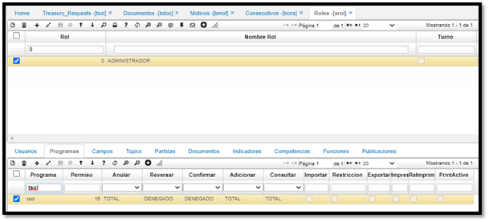
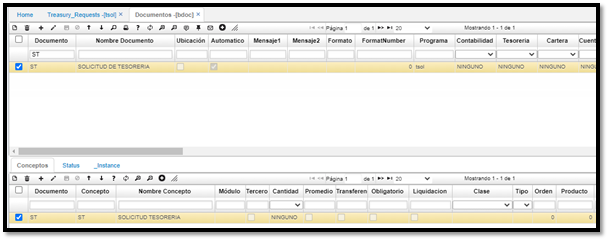
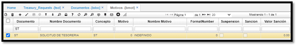
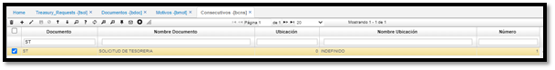
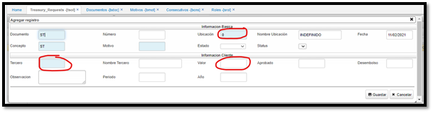
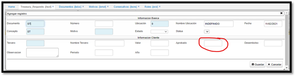
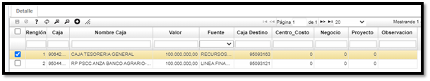

# Solicitudes Tesoreria - TSOL  

Opción **TSOL**, similar TGTR compuesta por maestro y detalle. En el maestro esta solicitado el valor por agencia y en el detalle los valores aprobados a las cajas destino.  

* Para el correcto funcionamiento de la funcionalidad se debe tener presente las siguientes configuraciones básicas previo a realizar utilización de la opción **[TSOL]:**  

1.	Hacer configuración del programa [TSOL] en [SPRO], esta información esta incluida en el Script de actualización, sin embargo, se adjunta en este documento.  

insert into Program ( ProgramId, ProgramName, Permission, Type, "Level", "Order",Parent, Model, "View", ModuleId, Company, State, Source, Device,Controller,Action)  
Values ('tsol', 'Treasury Requests', 15, 'C', 3, 1,'tmovimient','Movement', 'MovementTreasuryRequests', 'Treasury', 1, 'A', 'T', 'W','Genericg','Index')  

insert into ProgramDetail (ProgramId, Type, "RowId", Argument, Name,Enable,Focus,Model,[View])  
values ('tsol', 'B', 1, 'p_MovementTransfer','Generar Movimientos Transferencia',1,'M','','');  

insert into ProgramDetail (ProgramId, Type, "RowId", Argument, Name,Enable,Focus,Model,[View])  
values ('tsol', 'R', 1, 'DocumentId','',0,'','','');  

insert into ProgramDetail (ProgramId, Type, "RowId", Argument, Name,Enable,Focus,Model,[View])  
values ('tsol', 'R', 2, 'NumberId','',0,'','','');  

insert into ProgramDetail (ProgramId, Type, "RowId", Argument, Name,Enable,Focus,Model,[View])  
values ('tsol', 'R', 3, 'LocationId','',0,'','','');  

insert into ProgramDetail (ProgramId, Type, "RowId", Argument, Name,Enable,Focus,Model,[View])  
values ('tsol', 'T', 1, '','Detail',1,'M','MovementDetail','MovementDetailTreasuryRequests');  

-- Creacion opcion zcash3, zoom cajas destino detalle tsol   
insert into Program ( ProgramId, ProgramName, Permission, Type, "Level", "Order",Parent, Model, "View", ModuleId,       Company, State, Source, Device,Controller,Action)  
Values ('zcash3', 'Cash', 8, 'A', 3, 2,'reciclar','Location', 'CashDestinyZoom', 'Basic', 1, 'A', 'T', 'W','','')  

insert into ProgramDetail (ProgramId, Type, "RowId", Argument, Name,Enable,Focus,Model,[View])  
values ('zcash3', 'A', 1, 'LocationId1','',0,'','','');  

insert into ProgramDetail (ProgramId, Type, "RowId", Argument, Name,Enable,Focus,Model,[View])  
values ('zcash3', 'R', 1, 'LocationId','',1,'M','','');  

insert into ProgramDetail (ProgramId, Type, "RowId", Argument, Name,Enable,Focus,Model,[View])  
values ('zcash3', 'R', 2, 'SourceId','',1,'D','','');  

2 . Realizar las configuraciones pertinentes en los roles a los cuales deben tener acceso los diferentes usuarios.  Importante denegar la confirmación y anulación.  

  

3 .  Configurar Documento y Concepto en la opción [bdoc], allí configurar el documento ST o STE, importante asociar el programa [tsol] y el módulo tesorería “T”  

  

4 .	Con figurar motivo 0 INDEFINIDO  en la opción [bmot]  

  

5 .	Crear consecutivo correspondiente al documento ST o STE  

  

Con la configuración básica para el correcto funcionamiento de la opción [TSOL], nos permitimos indicar la forma de operar correctamente dicha opción:  

1 .	Para el perfil solicitante debe tener presenta la siguiente configuración a nivel de rol y de operación:  

	a.	Este perfil debe tener únicamente permisos al maestro del [TSOL].  Importante diligenciar en ubicación el punto de compra o agencia solicitante (estaría ubicación de acceso por defecto), en tercero quien solicita y en valor el valor a solicitar. También pueden ocultar los campos que requieran según este perfil.  
    
  

	b.	Guardar información y ya quedara disponible la solicitud para ser aprobada  
2 .	Para el perfil aprobador deberá editar la solicitud e ingresar el valor aprobado a transferir.  
  

3 .	Para el perfil que genera las transferencias debe diligenciar el detalle indicando de cual caja van a transferir los fondos y a que caja del punto se realizara la transferencia.  Importante utilizar los zoom de ayuda ya que en caja destino solo se permitirán cajas que pertenezcan al punto que está solicitando.  

  

* Al diligenciar el detalle se debe ejecutar el botón configurado en el maestro del **[TSOL]** el cual generara las transferencias de forma automática en **[TMOV] (CE x TR)**.  Se creará un **[TMOV]** por cada registro del detalle del **[TSOL]** y de esta forma culmina el proceso.  

---

