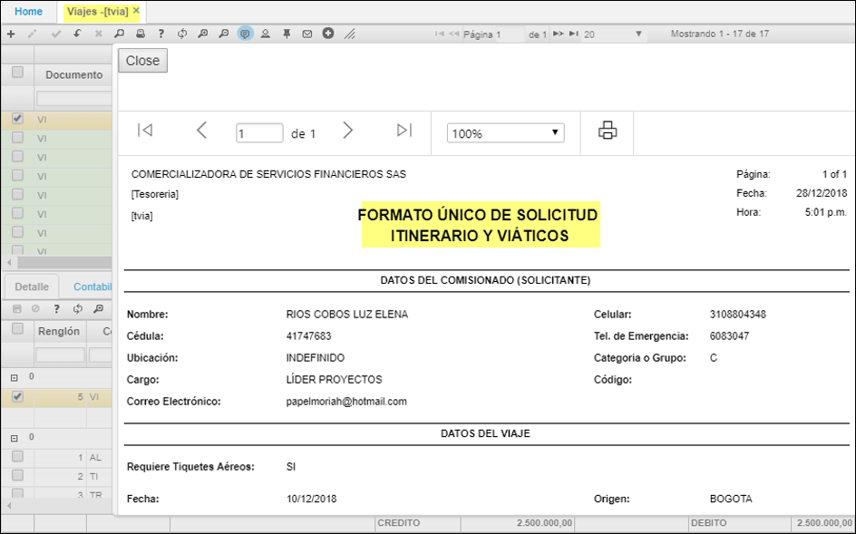

## Viajes -FORMATO SOLICITUD ITINERARIO Y VIÁTICOS - TVIA

Aplicación de movimientos, donde se registran solicitudes de itinerario y viajes y legalizaciones de estos.  
Contablemente sus contrapartidas son cartera contra el gasto. En las legalizaciones se detallan los diferentes conceptos como: alimentación, tiquetes, hotel, trasportes etc. tipo débitos contra el gasto.  

Recuerde que este documento se realiza por la ubicación que haya sido designada para administrar estos recursos.  

No olvide ingresar el tercero responsable, se manejan dos tipos de documentos un **VI - VIAJES ANTICIPO; VL - VIAJES LEGALIZACION**.

**Documento:** Iniciales del documento.  
**Número:** Número con el cual se ingresa al sistema el movimiento.  
**Ubicación:** Identificación numérica y nombre de la ubicación que genera el movimiento.  
**Fecha:** Fecha en la cual se hace el movimiento.  
**Concepto:** Concepto por el cual se va a registrar el movimiento.  

**Nombre Tercero:** Nombre del tercero quien es responsable del viaje.  
**Estado:** Estado en el cual se encuentra el movimiento, Activo, Procesado, Anulado.  
* En el maestro se relacionan los siguientes campos:
* RequiresTicket:  
* RequiresHotel:  
* 'FechaOriginal' y 'ExpireDate'.  

 Funcionabilidad:  para que en la solicitud de los viáticos el solicitante pueda registrar si requiere tiquetes, hotel y editar fechas de la estadía del hotel.  

******************
En el detalle del documento se relacionan los conceptos que han sido designados para ser controlados. Antes se debe asegurar que los conceptos hayan sido creados en la opción **BDOC** y la contabilización se debe definir en la opción **BPLA**.  
* Campos ImpConsumo, ValueTax en el detalle; para que cuando legalicen las facturas de lo gastado; los viáticos diferencien el subtotal y los impuestos (IVA e impuesto al consumo).  

* Esta aplicación permite exportar e imprimir.  

