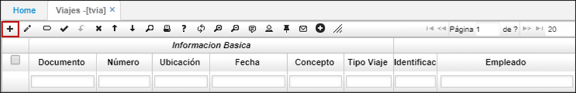
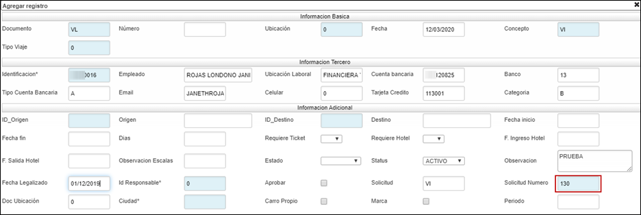
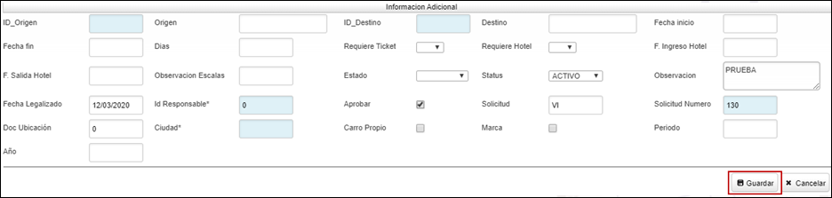
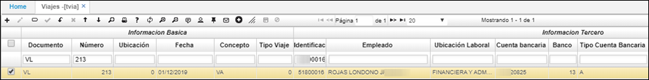
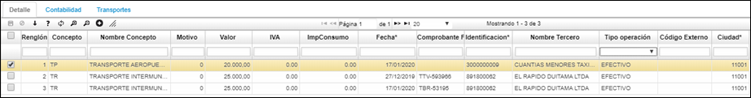
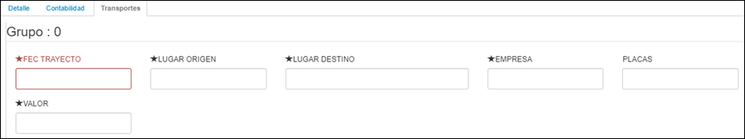
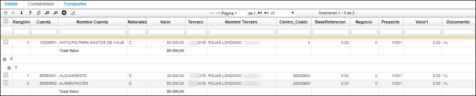
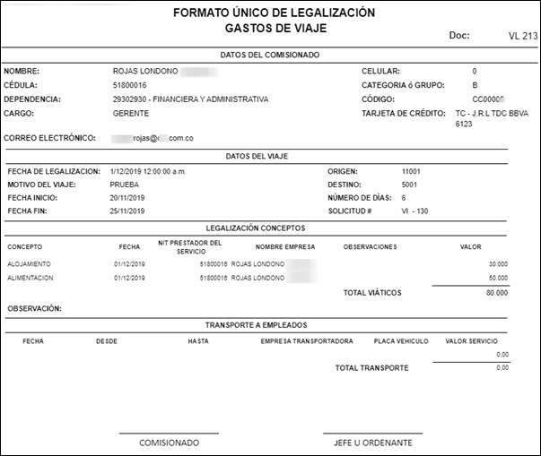

## TVIA - Formato Solicitud Itinerario y Viáticos 

Aplicación de movimientos, donde se registran solicitudes de itinerario y viajes y legalizaciones de estos.  
Contablemente sus contrapartidas son cartera contra el gasto. En las legalizaciones se detallan los diferentes conceptos como: alimentación, tiquetes, hotel, trasportes etc. tipo débitos contra el gasto.  

No olvide ingresar el tercero responsable, se manejan dos tipos de documentos un **VI - VIAJES ANTICIPO; VL - VIAJES LEGALIZACION**.

>+ [VI - Anticipo Viáticos](http://docs.oasiscom.com/Operacion/erp/tesoreria/tmovimient/tvia#vi---anticipo-viáticos)
>+ [VL - Legalización Viáticos](http://docs.oasiscom.com/Operacion/erp/tesoreria/tmovimient/tvia#vl---legalización-viáticos)

## [Anticipo Viáticos](http://docs.oasiscom.com/Operacion/erp/tesoreria/tmovimient/tvia#anticipo-viáticos)

Para crear una solicitud de viáticos, se debe ingresar a la aplicación TVIA y dar clic en el en el recuadro con el símbolo más (+), como se muestra a continuación: 

Seguidamente, aparece un formulario en el cual se deben diligenciar los campos teniendo en cuenta lo siguiente:

- **Documento:** Se debe diligenciar el documento VI debido a que es una solicitud de viático.  
- **Ubicación:** En este campo, si el colaborador que está realizando la solicitud tiene tarjeta debe ingresar el número de esta, de lo contrario, por defecto se debe diligenciar el número 1 en este campo.  
- **Concepto:** En este campo se debe ingresar el concepto por el cual se está realizando la solicitud.  
- **Identificación:** En este campo se diligencia el número del documento de identidad del colaborador que está realizando la solicitud.  

Al diligenciar el número de documento, los campos **Empleado, Ubicación laboral, Cuenta Bancaria, Banco, Tipo de Cuenta Bancaria, Email, Celular, Tarjeta de Crédito y Categoría** son diligenciados automáticamente por el sistema de acuerdo con la parametrización del [BTER.](http://docs.oasiscom.com/Operacion/common/btercer/bter)

- **ID Origen:** En este campo se diligencia la ubicación de partida del colaborador.  
- **ID Destino:** En este campo se diligencia el lugar de destino del colaborador.  
- **Fecha inicio:** Se diligencia la fecha desde cuando se realizará el viaje.  
- **Fecha final:** Se diligencia fecha hasta cuando se realizará el viaje.  
- **Días:** En este campo se debe diligenciar el número de días en total del viaje.  
- **Requiere ticket:** En este campo se despliegan dos opciones en caso de que se requiera (Si) o no se requiera ticket (No).  
- **Requiere hotel:** En este campo se despliegan dos opciones en caso de que se requiera (Si) o no se requiera hotel (No).  
- **Ciudad:** Se debe diligenciar la ubicación geográfica del colaborador.  
- **Aprobar:** Debe activarse el check en este campo.  

Al estar diligenciados los campos mencionados se debe dar clic en el botón **Guardar.** Cuando el registro queda guardado se puede evidenciar que el sistema genera un nuevo renglón. A continuación, en el Detalle se debe dar clic en el símbolo más (+) para ingresar las solicitudes de viáticos por los conceptos requeridos. 

Al dar doble clic en el campo *Concepto* el sistema arroja los conceptos que han sido asignados previamente en la parametrización, allí se selecciona el concepto requerido para la solicitud. 

En los siguientes campos se debe diligenciar de acuerdo con lo requerido.
Al tener los campos diligenciados debidamente, se debe dar clic en el botón que se muestra en la siguiente imagen para guardar.

Al guardar se crea un nuevo renglón en el Detalle. En caso de requerirse se pueden realizar más registros por otros conceptos. 

Una vez se culmina con el diligenciamiento de la solicitud, el área encargada procesa el documento para que el sistema realice la causación contable correspondiente de acuerdo con la parametrización del [**BPLA.**]() Esto se puede visualizar en la pestaña contabilización de la solicitud.

Recuerde que este documento se realiza por la ubicación que haya sido designada para administrar estos recursos.  

**Documento:** Iniciales del documento.  
**Número:** Número con el cual se ingresa al sistema el movimiento.  
**Ubicación:** Identificación numérica y nombre de la ubicación que genera el movimiento.  
**Fecha:** Fecha en la cual se hace el movimiento.  
**Concepto:** Concepto por el cual se va a registrar el movimiento.  
**Nombre Tercero:** Nombre del tercero quien es responsable del viaje.  
**Estado:** Estado en el cual se encuentra el movimiento, Activo, Procesado, Anulado.  

En el maestro se relacionan los siguientes campos:

>+ RequiresTicket.  
>+ RequiresHotel.  
>+ 'FechaOriginal' y 'ExpireDate'.  

*Funcionabilidad:  para que en la solicitud de los viáticos el solicitante pueda registrar si requiere tiquetes, hotel y editar fechas de la estadía del hotel.*  

En el detalle del documento se relacionan los conceptos que han sido designados para ser controlados. Antes se debe asegurar que los conceptos hayan sido creados en la opción [**BDOC**](http://docs.oasiscom.com/Operacion/common/bsistema/bdoc) y la contabilización se debe definir en la opción [**BPLA**.]()  

* Campos ImpConsumo, ValueTax en el detalle; para que cuando legalicen las facturas de lo gastado; los viáticos diferencien el subtotal y los impuestos (IVA e impuesto al consumo).  

Para ver en detalle el formato de legalización de Gastos del Viaje se debe dar clic en la lupa que aparece en la parte superior de la página:

El formato que se podrá visualizar es el siguiente:

## [Legalización Viáticos](http://docs.oasiscom.com/Operacion/erp/tesoreria/tmovimient/tvia#legalización-viáticos)

Para realizar la Legalización de la solicitud, se debe ingresar a la aplicación **TVIA** y dar clic en el botón más (+) para que aparezca el formulario.

En el formulario que aparece se debe ingresar en el campo documento las iniciales *VL* (Legalización de viático), el *tercero* (la cédula del empleado) y en los campos solicitud, solicitud número y doc ubicación se debe asociar la solicitud del viático creada anteriormente. Posteriormente, el rol que corresponde debe aprobar la legalización por medio del campo Aprobar activando el check. 

Al tener diligenciados los campos en el formulario se procede a dar clic en el botón *Guardar.*

El sistema crea un nuevo renglón cuando el registro se *guarda,* como se muestra a continuación: 

Al realizar esto, el sistema trae automáticamente del detalle de acuerdo con los conceptos registrados en la solicitud, allí se debe iniciar la legalización por cada uno de los conceptos, registrando el valor que corresponde, si tiene IVA o impuesto al consumo se debe registrar el valor correspondiente a estos impuestos, el motivo (esto identificará a que cuenta del gasto debe causar el concepto), la fecha de la factura, el comprobante, el tercero que facturó, la ciudad en la que se tomó el servicio o producto y el método de pago en la operación, si fue con efectivo, por boucher o con avance de la tarjeta de crédito.

En el Detalle también se encuentra el recuadro *Transportes*, donde se habilitan unos campos que se pueden diligenciar para detallar los transportes tomados por los colaboradores.

Una vez se culmina con el diligenciamiento de la solicitud, el área encargada procesa el documento para que el sistema realice la causación contable correspondiente de acuerdo con la parametrización del [**BPLA.**]() Esto se puede visualizar en la pestaña contabilización de la solicitud.

Para ver en detalle el formato de legalización de Gastos del Viaje se debe dar clic en la lupa que aparece en la parte superior de la página: 

El formato que se podrá visualizar es el siguiente: 

