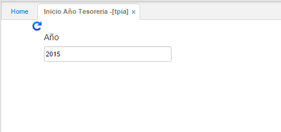

## Inicio Año Tesorería - TPIA

La aplicación **TPIA** se utiliza para realizar los traslados de los saldos del módulo de tesorería de un año a otro, es decir, cuando se hace cierre de año se genera este proceso y así los saldos quedan en el año siguiente. Para esto se debe indicar el año que se va a iniciar cómo se muestra en la imagen y se genera el proceso, una vez generado se puede validar en la aplicación **TSSP** los saldos para el periodo 1 (enero) del año generado.  

Se consulta por periodo y año.  

