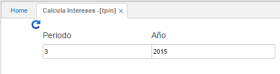

---
layout: default
title: Calcula Intereses
permalink: /Operacion/erp/tesoreria/tproceso/tpin
editable: si
---

# Calcula Intereses - TPIN

Proceso que se debe generar para liquidar los intereses del periodo. Este proceso genera automáticamente un documento en **KMOV - Movimientos de Tesorería**.  

Se consulta por periodo y año.  




