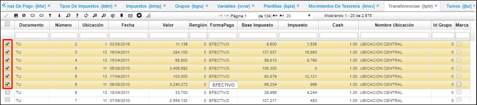
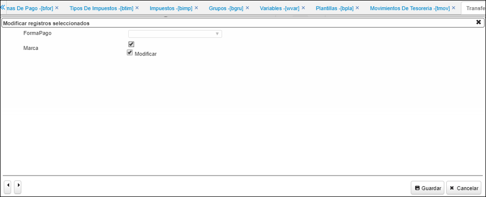

# Transferencias - TPTR

La aplicación TPTR permite generar transferencias automáticas de movimientos de tesorería con sus respectivos porcentajes de retención a las cuentas bancarias correspondientes por cada transacción realizada.  

El proceso de transferencia de una caja a un banco en OasisCom sin tener la necesidad de realizar el traslado en [**TMOV**](http://docs.oasiscom.com/Operacion/erp/tesoreria/tmovimient/tmov) se realiza teniendo en cuenta la parametrización realizada en las siguientes aplicaciones: (_Ver cada aplicación_) 

* [BFOR - Formas de pago](http://docs.oasiscom.com/Operacion/common/bcomer/bfor#parametrización-para-las-transferencias-de-dinero)
* [BTIM - Tipos de impuestos](http://docs.oasiscom.com/Operacion/common/bimpu/btim#parametrización-para-las-transferencias-de-dinero)
* [BIMP - Impuestos](http://docs.oasiscom.com/Operacion/common/bimpu/bimp#parametrizaci%C3%B3n-para-las-transferencias-de-dinero)
* [BGRU - Grupos](http://docs.oasiscom.com/Operacion/common/bcuenta/bgru#parametrizaci%C3%B3n-para-las-transferencias-de-dinero)
* [WVAR - Variables](http://docs.oasiscom.com/Operacion/dss/bsc/wbasica/wvar#parametrizaci%C3%B3n-para-las-transferencias-de-dinero)

Para realizar el proceso de transferencias, ingresamos a la aplicación TPTR y seleccionamos los turnos a los cuales les requerimos hacer la transferencia de dinero de la caja al banco, se puede realizar la operación masiva seleccionando varios turnos, dando click en el primer botón “Marca_Todo”.  

Se le activa el flag de _modificar_, posteriormente el de _marca_ y por último damos click en guardar.  

El sistema marca todos los registros seleccionados.  

Posteriormente, se seleccionan y se da clic en el botón de _“Gerencia_Transferencia”_ y allí el sistema crea un documento CE (comprobante de egreso) por concepto TR (transferencia) en la aplicación CMOV asociando el turno correspondiente.  

El sistema arroja el registro en estado procesado y genera un comprobante de egreso por cada turno. Se debe validar la parametrización de la plantilla del CE x TR en la aplicación [**BPLA - Plantillas**](http://docs.oasiscom.com/Operacion/common/bcuenta/bpla).  
