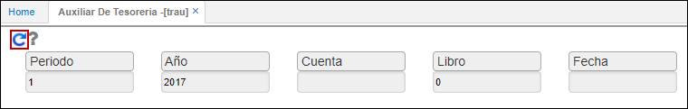

# TRAU - Auxiliar de Tesorería

La aplicación TRAU permite visualizar los movimientos diarios de tesorería como lo son recibos de caja, facturas, egresos, pagos de nómina, entre otros.  

Consultamos por periodo, año, cuenta contable si se desea, libro contable y fecha. Si algún campo no se desea consultar en específico dejamos el campo en blanco.  

El sistema arrojará la información de acuerdo a los datos filtrados. El reporte puede ser descargado en formato de Word, PDF o Excel.  

