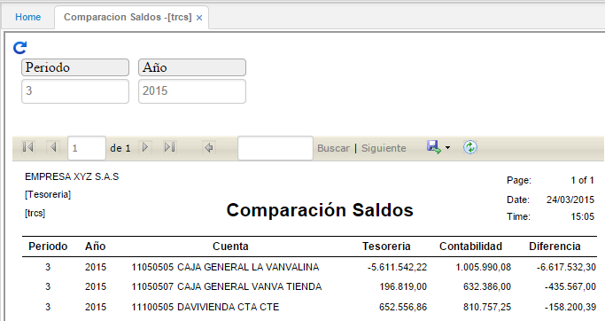

## Comparación de Saldos - TRCS

Este reporte permite la validación del estado de los saldos del módulo de tesorería frente a los saldos del módulo de contabilidad, indicando si existe alguna diferencia.

Es posible consultar por periodo, año, libro contable (libro 1 - IFRS, libro 0 - LOCAL) y cuenta contable.  

