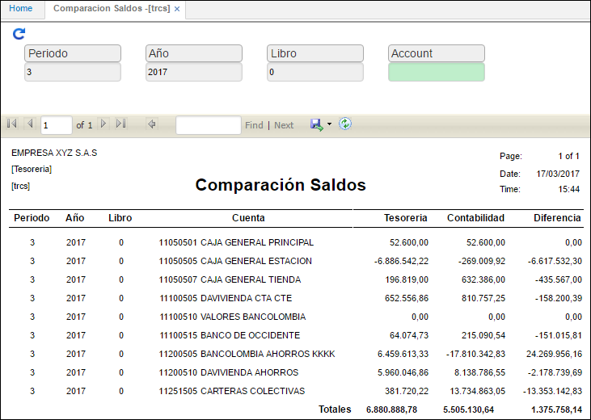

# Comparación de Saldos - TRCS

Este reporte permite la validación del estado de los saldos del módulo de tesorería frente a los saldos del módulo de contabilidad, indicando si existe alguna diferencia.

Se consulta por periodo y año.

