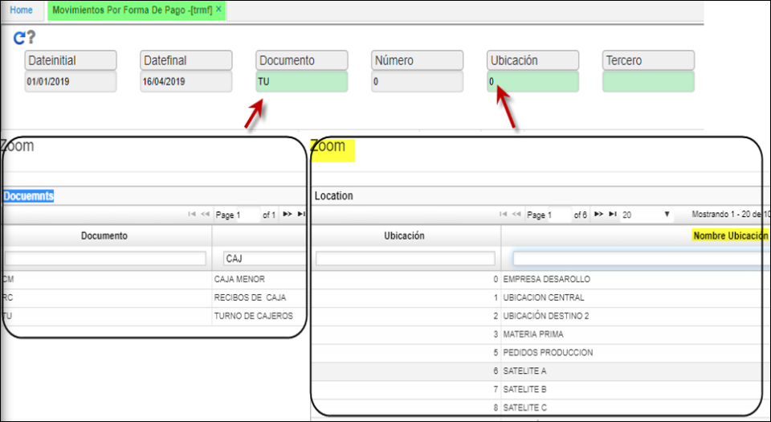

## Movimientos por Forma de Pago - TRMF

Este reporte **TRMF** permite visualizar las diferentes formas de pago del **BFOR**; como cheques que han sido cambiados por efectivo en las diferentes agencias o ubicaciones parametrizadas en **BUBI** entre otras consultas.

Se filtra por Dateinicial, Datefinal, Numero, Ubicación, Tercero .  

**Dateinicial:** rango de fecha de la consulta (desde).  
**Datefinal:**	ramgo de fecha de la consulta (hasta).  

**Documento:** movimiento creado en **BDOC** que afecta tesoreria, posee zoom de busqueda al dar doble click.
**Numero:** consecutivo del documento.  
**Ubicación:** ingresar el número de ubicación que se desea consultar, en caso que se desconozca, dar doble click en el campo y seleccionar la ubicación desde zoom.  
**Tercero** persona natural o juridica a quien afecto el documento, creado en **BTER.**  

