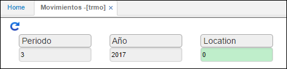

# Movimientos - TRMO

La aplicación **TRMO** muestra los movimientos realizados en el módulo de tesorería en un periodo determinado.  

Se filtra por periodo, año y ubicación.  

**Periodo:** mes del cual se desea realizar la consulta.  
**Año:** año de consulta.  
**Ubicación:** ingresar el número de ubicación que se desea consultar, en caso que se desconozca, dar doble click en el campo y seleccionar la ubicación desde zoom.  

