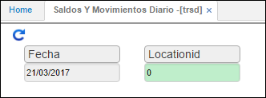
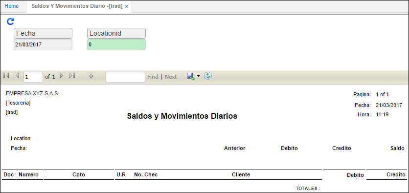

## Saldos y Movimientos Diarios - TRSD

La aplicación **TRSD** permite consultar los saldos y movimientos diarios que se realicen en el módulo de tesorería, por lo tanto se filtra por la fecha indicando el día que se requiere consultar y por una ubicación específica, esta ubicación esta previamente parametrizada en la aplicación **BUBI**.  

En el reporte se podrá ver el saldo del día anterior, al igual que los valores débitos y créditos de acuerdo a los movimientos realizados en la fecha y el saldo total con el que termina el día.  

Se consulta por fecha y ubicación.  

