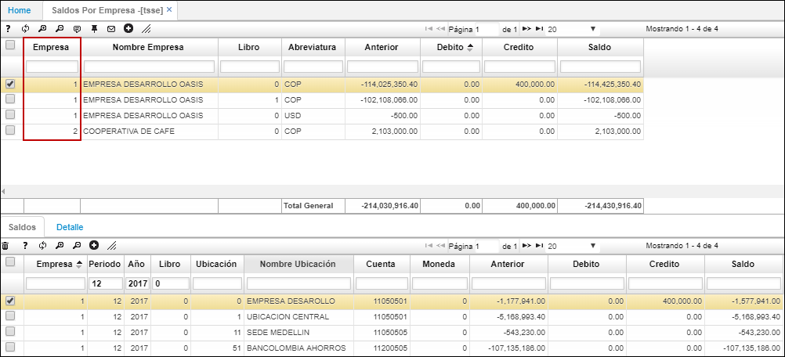

# TSSE - Saldos por empresa

La aplicación TSSE muestra los movimientos de cartera agrupados por modena de la opción [**TMOV - Movimientos de Tesorería**](http://docs.oasiscom.com/Operacion/erp/tesoreria/tmovimient/tmov), de las diferentes compañías a las que el usuario tenga permisos de ingreso.  

En el detalle, podemos ver los diferentes movimientos de cartera de la empresa seleccionada en el maestro, por cada una de las ubicaciones existentes en la misma.  

En la pestaña _Detalle_, se visualizarán los documentos relacionados a dichos movimientos.  

