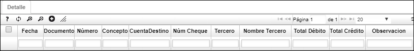

# Saldos por Periodos - TSSP

En esta aplicación se pueden consultar los saldos por periodos de las ubicaciones definidas como cajas, permite filtrar por los diferentes campos que la componen.  

En el maestro de la aplicación se encuentran los saldos de las ubicaciones, discriminando el saldo anterior al periodo, los movimientos del periodo y el saldo actual del periodo.  

Se puede consultar por Periodo, Año y Ubicación.  

En el detalle de la aplicación se muestran específicamente cada uno de los movimientos que está afectando el saldo de las respectivas ubicaciones.  

