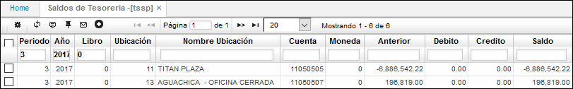

## Saldos por Periodos - TSSP

En esta aplicación se pueden consultar los saldos por periodos de las ubicaciones definidas como cajas, permite filtrar por los diferentes campos que la componen.  

En el maestro de la aplicación se encuentran los saldos de las ubicaciones, discriminando el saldo anterior al periodo, los movimientos del periodo y el saldo actual del periodo.  

Se puede consultar por Periodo, Año y Ubicación.  

**Periodo:** Ingresar el periodo a consultar.  
**Año:** Ingresar el año de consulta.  
**Libro:** indicar el libro contable del cual se desea consultar. Libro 1 - IFRS, libro 0 - LOCAL.  
**Ubicación:** Indicar la ubicación de la cual se desea realizar la consulta.  
**Cuenta:** Cuenta contable de la cual se realiza la consulta.  
**Moneda:** muestra el tipo de moneda utilizada. Los tipos de moneda son parametrizables en la aplicación **BMON**.  
**Anterior:** Valor numérico de la cuenta antes de iniciar el periodo.  
**Débito:** Valor numérico de movimientos debito realizados durante el periodo.  
**Crédito:** Valor numérico de movimientos crédito realizados durante el periodo.  
**Saldo:** Valor numérico con el que queda la cuenta al final del periodo.  

En el detalle de la aplicación se muestran específicamente cada uno de los movimientos que está afectando el saldo de las respectivas ubicaciones.  

**Fecha:** fecha del movimiento.  
**Documento:** Documentos que soportan el movimiento del maestro.  
**Número:** Número de los documentos.  
**Concepto:** Conceptos que se registraron para cada documento.  
**Cuenta Destino:** Cuenta contable de destino relacionada con el movimiento consultado.  
**Núm Cheque:** número de cheque asociado al movimiento.  
**Tercero:** número de identificación del tercero asociado al movimiento que afecta el saldo consultado.  
**Total Débito:** Valor numérico del débito del movimiento que está afectando el saldo.  
**Total Crédito:** Valor numérico del crédito del movimiento que está afectando el saldo.  
**Observación:**  permite registrar información adicional a la causación.  
