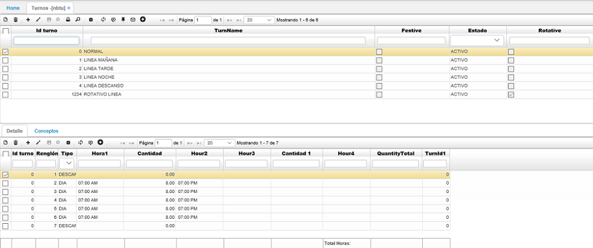

# NBTU - Turnos

## [Control de acceso a la aplicación por turnos](http://docs.oasiscom.com/Operacion/hrm/asistencia/nabasica/nbtu#control-de-acceso-a-la-aplicaci%C3%B3n-por-turnos)

En la aplicación _NBTU_ se parametrizarán los diferentes turnos que maneja la empresa teniendo en cuenta el flag de **FESTIVO** que indica que ese turno labora festivos o no, igualmente, se deberá tener en cuenta el flag de **ROTATIVO** lo cual indica que el turno se compone de varios, es decir, que puede utilizarse para incluir labores en el día, tarde o noche como es el caso de los empleados de la línea de atención al usuario.  

En el detalle de esta opción se deben incluir los días de la semana con su respectivo horario para el caso de los turnos no rotativos, teniendo en cuenta que la semana empieza con Domingo (Renglón 1) y para los rotativos los turnos que componen la rotación.  

A continuación, ingresaremos a la aplicación [**NCNT - Contratos de Nómina**](http://docs.oasiscom.com/Operacion/hrm/nomina/nbasica/ncnt#control-de-acceso-a-la-aplicaci%C3%B3n-por-turnos) en donde se definirá el turno por defecto del empleado.  

