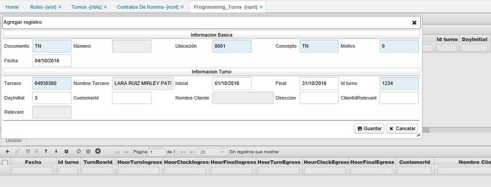
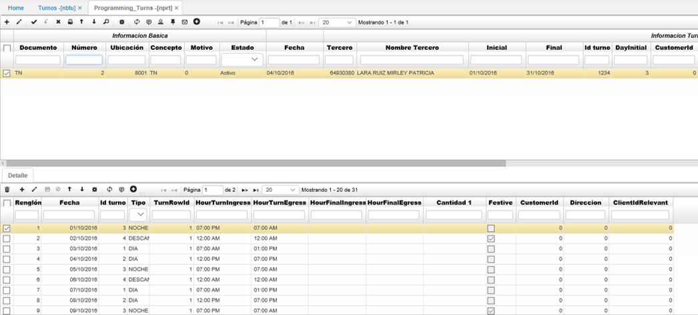

# NPRT - Programación de Turnos

En esta aplicación se crea un movimiento que puede ser mensual, se ingresa la cédula del empleado, fecha Inicial, fecha Final, el Id del Turno y muy importante el Día Inicial. Este día Inicial indica en que número del renglón del detalle inicia la programación, es decir si el empleado empieza el mes en el turno de la mañana (1), Tarde (2), Noche (3) o de Descanso (4).  

Al guardar el movimiento se ejecuta el proceso de asignación día a día del horario a laborar y los días de descanso para las fechas indicadas en la programación. Con esta programación se controlará el acceso para los usuarios que tengan turnos rotativos.  

**_Nota:_** si el rol está con el turno _no activo_ este dejará iniciar sesión normalmente.  

Tampoco es necesario realizar programación para todos los empleados, únicamente los que tengan turnos rotativos.  

