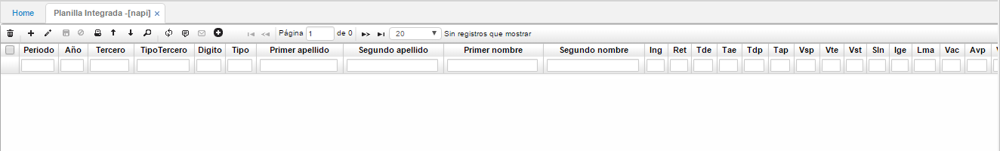

# PLANILLA INTEGRADA - NAPI

Una vez confirmados los documentos _AP_ en la opción **NAUT**, se puede generar el archivo plano en la opción **NAPI**.

Se debe consultar el periodo y el año que se desea generar, una vez realizada la consulta, pulsamos en el botón generar plano y escogemos una ubicación donde guardar el archivo generado.

