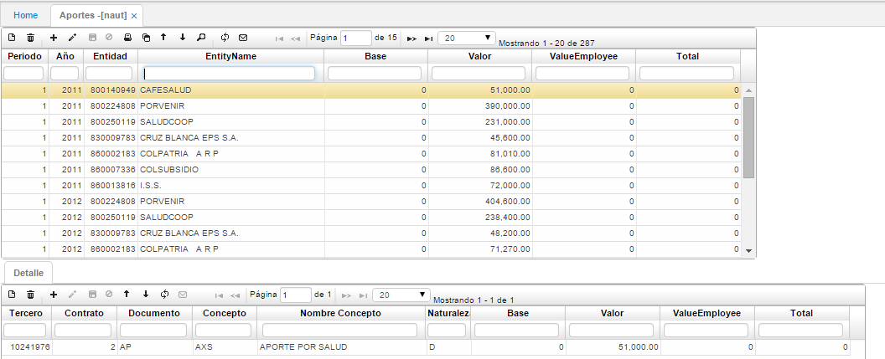

# APORTES - NAUT

Luego de ejecutar el proceso anterior **NAGE – Generar autoliquidaciones**, se genera un documento _AP – Aportes_ en la aplicación **NAUT - Aportes**, con fecha del último día del mes, como lo podemos observar en la siguiente imagen, en este documento se discriminan los valores por cada entidad. 

En el detalle de cada entidad se muestran los trabajadores que se encuentran afiliados a ella. Una vez validados estos cálculos realizados por el sistema se debe proceder a procesar los documentos _AP_.

