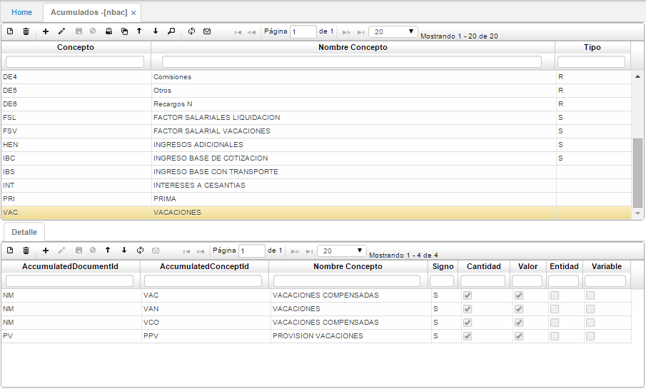

# ACUMULADOS - NBAC

En esta opción se definen los acumulados que se van a utilizar para el pago de vacaciones y liquidación definitiva, en el detalle de cada acumulado se deben incluir los conceptos que van a componerlo e indicar si suman o restan al acumulado en cantidad o en valor. Estos acumulados son almacenados por el sistema para cada periodo en la aplicación **NNSP – Saldos Acumulados**.

